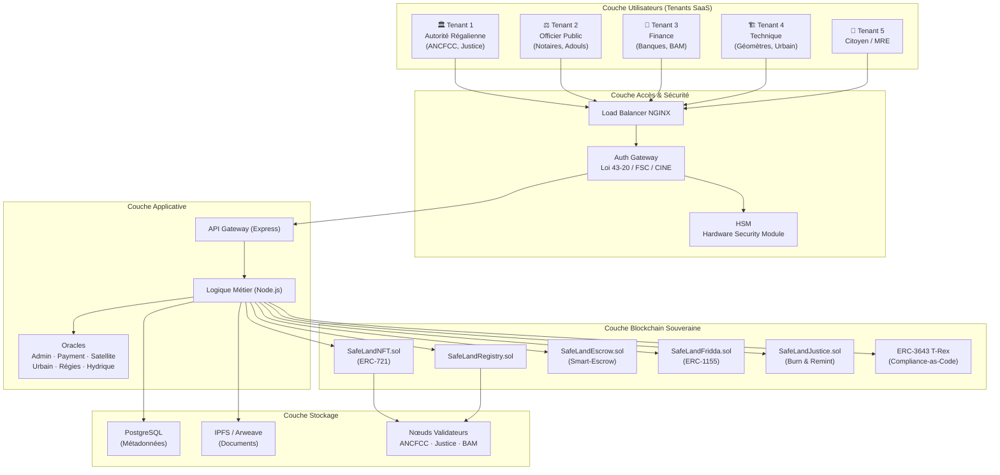
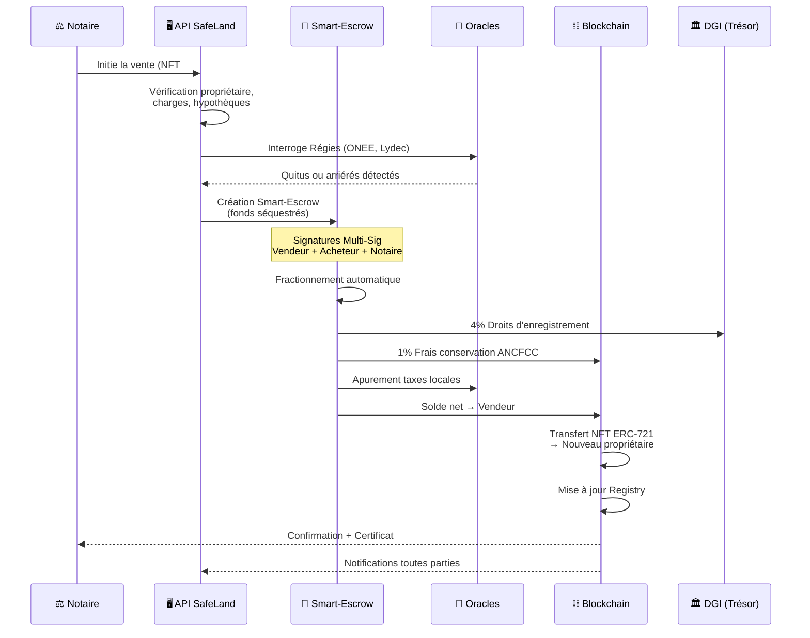

# Cahier des Charges - SafeLand
## Plateforme NFT de Sécurisation Foncière au Maroc (B2G)

**Version:** 2.0  
**Date:** 18 février 2026  
**Statut:** Document de spécification stratégique — Livre Blanc du Foncier 2.0  
**Sous-titre:** Transformer le patrimoine national en un actif numérique souverain, liquide et infalsifiable

---

## Table des Matières

1. [Contexte et Enjeux](#1-contexte-et-enjeux)
2. [Objectifs du Projet](#2-objectifs-du-projet)
3. [Périmètre du Projet](#3-périmètre-du-projet)
4. [Modèle B2G (Business to Government)](#4-modèle-b2g-business-to-government)
5. [Spécifications Fonctionnelles](#5-spécifications-fonctionnelles)
6. [Spécifications Techniques](#6-spécifications-techniques)
7. [Architecture Système](#7-architecture-système)
8. [Smart Contracts Solidity](#8-smart-contracts-solidity)
9. [Sécurité et Conformité](#9-sécurité-et-conformité)
10. [Intégration Gouvernementale](#10-intégration-gouvernementale)
11. [Interface Utilisateur](#11-interface-utilisateur)
12. [Planning et Livrables](#12-planning-et-livrables)
13. [Ressources et Budget](#13-ressources-et-budget)
14. [Risques et Mitigation](#14-risques-et-mitigation)
15. [Critères de Succès](#15-critères-de-succès)
16. [Conclusion et Prochaines Étapes](#16-conclusion-et-prochaines-étapes)
- [Annexes](#annexes)

---

## 1. Contexte et Enjeux

### 1.1 Vision et Raison d'Être : Le "New Deal" Foncier

Le projet SafeLand Morocco répond à une urgence nationale : la sécurisation absolue et la fluidification du patrimoine foncier marocain. En transformant le titre foncier en un **Jumeau Numérique Infalsifiable (NFT)**, SafeLand éradique les failles systémiques telles que la spoliation foncière, la paralysie des successions (Fridda) et l'opacité des transactions. L'objectif n'est pas de substituer les prérogatives des institutions, mais de déployer une **infrastructure de confiance partagée** où chaque transaction est certifiée en temps réel par les acteurs du droit (Notaires, Adouls, Conservateurs), garantissant une mutation de propriété transparente, instantanée et incontestable.

### 1.2 Problématique
Le secteur foncier au Maroc fait face à plusieurs défis majeurs qui impactent directement la confiance des citoyens et l'efficacité de l'administration. Ces défis incluent la fraude et la falsification des titres de propriété, des processus administratifs particulièrement longs et complexes, un manque de transparence dans les transactions immobilières, des difficultés importantes de traçabilité historique des biens, des coûts élevés de vérification et d'authentification, ainsi que des risques persistants de corruption et de double vente. S'y ajoutent des problématiques spécifiques au Maroc :

- **La spoliation foncière**, particulièrement celle touchant les Marocains Résidents à l'Étranger (MRE) vulnérables à distance
- **Le blocage des successions (Fridda)**, paralysant des milliers de biens en indivision
- **Le régime Melk** (terres non titrées), véritable "point aveugle" du foncier rural marocain, source de conflits
- **Les terres collectives (Soulaliyates)**, inaliénables, bloquant l'investissement agricole d'envergure
- **Le stress hydrique**, rendant la valeur d'un terrain agricole intrinsèquement liée à son accès à l'eau

### 1.3 Opportunités de la Blockchain
La technologie blockchain offre des solutions concrètes à ces problématiques grâce à l'immuabilité des enregistrements qui garantit qu'aucune donnée ne peut être modifiée rétroactivement. Elle permet une traçabilité complète des transactions depuis la création jusqu'à aujourd'hui, assure une transparence et une auditabilité totales pour toutes les parties prenantes, réduit considérablement le nombre d'intermédiaires nécessaires, permet l'automatisation des processus via des smart contracts, et offre une sécurité cryptographique avancée qui protège contre les falsifications.

En particulier, la **Compliance-as-Code** via le standard ERC-3643 permet d'intégrer les règles du droit foncier marocain directement dans le jeton, rendant toute transaction non conforme techniquement impossible. Le protocole SafeLand ne se contente pas de numériser des documents ; il **traduit le droit foncier en actifs programmables**.

### 1.4 Cadre Légal Marocain
Le projet SafeLand s'inscrit pleinement dans le cadre légal marocain en assurant :
- La conformité avec la **loi 39-08** relative à la Conservation Foncière
- Le respect du **Code des Droits Réels**
- L'alignement avec la **stratégie de digitalisation du gouvernement marocain (Plan Maroc Digital 2030)**
- La protection des données personnelles conformément à la **loi 09-08**
- La conformité à la **Loi 43-20** sur les services de confiance pour les transactions électroniques (signature électronique qualifiée, horodatage certifié)
- Le respect de la **Loi 53-05** sur l'échange électronique de données juridiques
- L'alignement avec les exigences de la **DGSSI** (Direction Générale de la Sécurité des Systèmes d'Information) pour la souveraineté numérique

---

## 2. Objectifs du Projet

### 2.1 Objectifs Principaux
Le projet SafeLand vise cinq objectifs principaux fondamentaux. Premièrement, numériser les titres fonciers sous forme de NFT (Non-Fungible Tokens) pour créer une représentation numérique unique et infalsifiable de chaque bien immobilier. Deuxièmement, sécuriser les transactions immobilières via la technologie blockchain pour éliminer les risques de fraude. Troisièmement, simplifier considérablement les processus administratifs qui sont actuellement sources de lenteur et de frustration. Quatrièmement, réduire drastiquement les fraudes et les litiges fonciers grâce à la transparence et l'immuabilité. Enfin, améliorer la transparence et la confiance entre tous les acteurs de l'écosystème foncier.

### 2.2 Objectifs Secondaires
Au-delà des objectifs principaux, le projet ambitionne également de créer un registre foncier numérique décentralisé accessible à tous les acteurs autorisés, de faciliter l'accès à l'information foncière de manière sécurisée et contrôlée, de réduire significativement les coûts de transaction en éliminant les processus redondants, d'accélérer les délais de traitement qui peuvent actuellement prendre plusieurs mois, et de contribuer à la modernisation générale de l'administration foncière marocaine.

### 2.3 Indicateurs de Performance (KPI)
Le succès du projet sera mesuré par des indicateurs quantifiables précis : une réduction de 70% du temps de traitement des transactions, une diminution de 80% des cas de fraude détectés, une augmentation de 60% de la satisfaction des utilisateurs mesurée par des enquêtes régulières, et une économie de 50% sur les coûts administratifs globaux.

---

## 3. Périmètre du Projet

### 3.1 Inclus dans le Périmètre
Le périmètre du projet SafeLand inclut le développement complet des smart contracts en langage Solidity, le déploiement sur réseau blockchain Polygon en commençant par un testnet avant le mainnet, la création d'une interface web complète et intuitive pour les autorités gouvernementales, le développement d'une API d'intégration robuste avec les systèmes existants, un système complet de gestion des NFT fonciers avec toutes les fonctionnalités nécessaires, un module de vérification et d'authentification avancé, un système de traçabilité exhaustif des transactions, une documentation technique complète et détaillée, ainsi que la formation approfondie des administrateurs gouvernementaux.

### 3.2 Hors Périmètre (Phase 1)
Certaines fonctionnalités ne sont pas incluses dans la première phase du projet et seront envisagées ultérieurement : l'application mobile grand public, l'intégration avec un cadastre 3D avancé, le paiement direct en cryptomonnaie, la tokenisation fractionnée des biens permettant la co-propriété numérique, et une marketplace publique de revente.

### 3.3 Périmètre Étendu — Modules d'Inclusion Territoriale (Phase 2)
Le document Word stratégique a identifié des modules cruciaux pour l'inclusion nationale, intégrés dans le périmètre élargi :
- **Module Pré-Immatriculation Blockchain (Terres Melk)** : Passerelle numérique vers l'immatriculation officielle ANCFCC via des NFT de "Présomption de Propriété"
- **Module Terres Collectives (Soulaliyates & Habous)** : Tokenisation du droit d'usage (usufruit) via des NFT de location longue durée (emphytéose ERC-1155)
- **Module Droits d'Irrigation et Stress Hydrique** : NFT "Droit d'Eau" lié au NFT foncier, avec gestion dynamique des quotas par les ORMVA
- **Module 3D & Verticalité** : Tokenisation du tréfonds (sous-sol) et des droits de surélévation (Air Rights)
- **Module Succession Fridda** : Moteur algorithmique conforme au droit successoral marocain et au droit musulman
- **Service Watchtower MRE** : Protection active anti-spoliation pour les Marocains du Monde
- **Crédits Carbone Foncier** : Tokenisation des services écosystémiques pour le financement de la transition verte

### 3.4 Évolutions Futures (Phase 3)
Les évolutions prévues pour les phases ultérieures incluent l'extension à d'autres types de biens au-delà du foncier, l'intégration de technologies IoT pour la surveillance physique des propriétés, le développement de smart contracts pour la gestion automatisée des locations et hypothèques, la mise en place d'un système de vote décentralisé pour les décisions en copropriété, le **Score de Liquidité Foncière** (rating IA pour le secteur bancaire), et l'intégration du **BIM (Building Information Modeling)** pour le passeport numérique du bâtiment.

---

## 4. Modèle B2G (Business to Government)

### 4.1 Définition du Modèle
Le modèle B2G (Business to Government) constitue le cœur de la stratégie commerciale de SafeLand. Il consiste à fournir une solution technologique blockchain complète et sur mesure à l'administration marocaine pour moderniser en profondeur la gestion foncière du pays. Ce modèle implique un partenariat stratégique à long terme avec les institutions gouvernementales, opérant sous un modèle de **Partenariat Public-Privé (PPP)** où SafeLand agit comme opérateur technique au service de la souveraineté.

### 4.2 Parties Prenantes

#### 4.2.1 Côté Gouvernement
L'Agence Nationale de la Conservation Foncière, du Cadastre et de la Cartographie (ANCFCC) joue le rôle central en tant que partenaire principal et **nœud validateur souverain** de la blockchain. Elle est responsable de la validation officielle des titres de propriété, de l'enregistrement officiel des NFT dans le système, de la supervision de toutes les transactions, et dispose du **"Panic Button"** administratif pour geler les mutations en cas de menace.

Le **Ministère de la Justice** assure la coordination avec le système judiciaire et détient les clés cryptographiques Multi-Sig du **protocole "Justice Override"** (Burn & Remint), permettant d'annuler des transactions frauduleuses sur ordonnance judiciaire.

Le **Ministère de l'Intérieur** assure la coordination administrative globale, le contrôle de conformité des opérations, et supervise les modules relatifs aux **terres collectives (Soulaliyates)** et à la paix sociale dans le monde rural.

Le **Ministère de l'Agriculture** bénéficie de la tokenisation des droits d'usage et d'eau, sécurisant l'investissement agricole sur les terres collectives.

**Bank Al-Maghrib** intervient comme nœud validateur pour les aspects financiers et comme Oracle de paiement via le système RTGS, confirmant les virements pour déclencher le Smart-Escrow.

La **Direction Générale des Impôts (DGI)** bénéficie du prélèvement fiscal automatique "At-the-Source" intégré dans les smart contracts de transaction.

La **DGSSI** (Direction Générale de la Sécurité des Systèmes d'Information) certifie l'infrastructure et valide la conformité souveraine.

#### 4.2.2 Côté Business (SafeLand)
SafeLand, en tant qu'**orchestrateur technologique**, prend en charge le développement complet et la maintenance continue de la plateforme blockchain, fournit un support technique de haut niveau disponible 24/7, organise et dispense la formation de tous les agents gouvernementaux, et assure l'évolution constante du système en fonction des besoins identifiés et des retours d'expérience. SafeLand **ne dispose jamais des clés de propriété des titres** — le pouvoir de validation reste exclusivement délégué aux entités régaliennes.

### 4.3 Architecture SaaS Multi-Tenant

SafeLand est structuré comme une plateforme **SaaS Multi-Tenant** où chaque acteur dispose d'une isolation logique garantissant l'étanchéité totale de ses données confidentielles tout en permettant une collaboration fluide sur le registre commun.

#### 4.3.1 Tenant "Autorité Régalienne" (ANCFCC & DGI)
- **Supervision Dynamique** : Tableau de bord décisionnel avec suivi des flux transactionnels et agrégats économiques nationaux en temps réel
- **Perception Fiscale Native** : Automatisation du prélèvement des droits d'enregistrement (ex: 4%) et de conservation, routés vers le Trésor sans délai
- **"Panic Button"** : Dispositif d'interruption d'urgence permettant au Conservateur Général de geler toute mutation
- **Console "Justice Override"** : Interface cryptographique de haut niveau pour l'exécution de décisions judiciaires

#### 4.3.2 Tenant "Officier Public" (Notaires & Adouls)
- **Studio de "Minting" & Instruction** : Workflow complet d'upload des actes authentiques et vérification d'identité via API CINE
- **Multi-Signature (Multi-Sig)** : La validation finale du transfert du NFT requiert la signature cryptographique du Notaire
- **Moteur Fridda** : Algorithme conforme au droit successoral marocain, générant la répartition exacte des parts entre héritiers (ERC-1155)
- **Smart-Escrow Dashboard** : Suivi transparent du séquestre, validation du transfert dès confirmation Oracle bancaire

#### 4.3.3 Tenant "Finance & Banques"
- **Hypothèque Programmable "One-Click"** : Inscription de charges directement sur le NFT avec attribut "Inaliénable" bloquant techniquement toute vente
- **Mainlevée Instantanée** : Signature numérique de la mainlevée dès remboursement, titre "Libre" en quelques secondes
- **Score de Solvabilité Foncière** : Accès sécurisé à l'état de santé du titre pour accord de crédit en temps réel

#### 4.3.4 Tenant "Technique & Urbain" (Géomètres & Agences Urbaines)
- **Interopérabilité SIG/BIM** : Chaque NFT lié à des coordonnées GPS certifiées, injection directe des plans de bornage
- **Smart-Zoning** : Oracle de conformité lié aux Agences Urbaines (ex: zone non-ædificandi) mis à jour dans les métadonnées du NFT
- **Contrôle de non-chevauchement** : Collision detection avec les titres voisins

#### 4.3.5 Tenant "Citoyen & MRE" (B2C)
- **Wallet Patrimoine** : Application mobile sécurisée pour visualiser ses propriétés comme des actifs numériques
- **Watchtower (Vigilance Anti-Spoliation)** : Alertes proactives (SMS/Push) sur toute tentative de consultation ou modification
- **"Verrou Voyage" (Travel Lock)** : Mode "Sommeil Profond" bloquant toute mutation via Smart Contract
- **Gouvernance de l'Indivision** : Espace de vote pour les héritiers avec seuils légaux programmés

### 4.4 Mécanisme de Consensus et Accountability

Chaque donnée injectée dans la blockchain est traçable jusqu'à la **signature de l'acteur** qui l'a validée (Notaire, Géomètre, Conservateur ou Banque). En cas d'erreur, la blockchain identifie quel tenant (quelle signature) a validé l'information. C'est l'argument ultime pour la **reddition des comptes (Accountability)**.

Les nœuds validateurs (ANCFCC, Ministère de la Justice, Bank Al-Maghrib) participent au consensus selon un protocole de type PBFT (Practical Byzantine Fault Tolerance) adapté, où la validation d'un bloc requiert l'accord d'au moins 2/3 des nœuds régaliens.

### 4.5 Flux de Valeur
Le modèle de création de valeur suit un flux logique : SafeLand apporte sa technologie blockchain de pointe et son expertise en innovation. Cette technologie garantit la sécurité et la transparence du système. Le gouvernement utilise cette infrastructure pour fournir une administration plus efficace et moderne. In fine, les citoyens bénéficient de services nettement améliorés, plus rapides, plus fiables et moins coûteux. L'État perçoit ses recettes fiscales en millisecondes avec un taux de recouvrement de 100%.

### 4.6 Modèle Économique

Le modèle économique repose sur un écosystème SaaS à multiples flux de revenus :

| Source de Revenu | Description | Cible Principale |
|---|---|---|
| **Licences "Tenant"** | Frais d'accès annuels pour les interfaces professionnelles sécurisées | Banques, Promoteurs, Fiduciaires, Notaires |
| **Transaction Fee** | Micro-commission sur chaque mutation, hypothèque ou mainlevée | Utilisateurs du réseau |
| **Premium MRE (Watchtower)** | Abonnement annuel pour la surveillance active et le verrouillage biométrique à distance | Marocains du Monde (MRE) |
| **Data Analytics** | Rapports prédictifs anonymisés sur les tendances du marché foncier (Big Data) | Investisseurs, État, Aménageurs |
| **Module Fridda** | Forfait par dossier de succession automatisé | Familles / Héritiers |
| **Frais de Certification** | Forfait pour la tokenisation initiale du patrimoine (Minting) | Grands propriétaires, État |

**Fiscalité Programmée "At-the-Source"** : Le Smart Contract de transaction agit comme agent de retenue automatique. Lors d'une vente, le flux financier est scindé instantanément : 4% (droits d'enregistrement) vers la DGI, 1% (frais de conservation) vers l'ANCFCC, taxes locales apurées via Oracles des régies, et solde net au vendeur. Le transfert du NFT est techniquement conditionné au paiement des droits, garantissant un **taux de recouvrement de 100%**.

---

## 5. Spécifications Fonctionnelles

### 5.1 Gestion des Titres Fonciers NFT

#### 5.1.1 Création de NFT Foncier
La création d'un NFT foncier est un processus rigoureux réservé aux agents ANCFCC authentifiés. Le processus débute par une vérification minutieuse du titre foncier physique pour s'assurer de son authenticité et de sa validité. Ensuite, tous les documents sont numérisés en haute résolution pour garantir la lisibilité et la conservation de tous les détails. Les métadonnées essentielles sont alors extraites : le numéro unique du titre foncier, la localisation GPS précise en coordonnées géographiques, la surface exacte en mètres carrés, le type de bien (terrain, villa, appartement, commerce, etc.), l'identité complète du propriétaire actuel avec son numéro de CIN, l'historique complet des transactions antérieures, ainsi que toutes les charges et servitudes associées au bien.

Les documents numérisés sont ensuite uploadés sur IPFS (InterPlanetary File System) ou Arweave pour garantir un stockage décentralisé et permanent. Le NFT est créé avec toutes les métadonnées stockées on-chain pour une immuabilité totale. Finalement, le NFT est attribué automatiquement au propriétaire légitime via son adresse wallet Ethereum.

Les données stockées incluent un identifiant unique (tokenId), le numéro de titre foncier officiel, le type de bien, la surface, la localisation complète (ville, quartier, coordonnées GPS), l'identité du propriétaire (avec nom hashé et CIN chiffré pour la protection des données), les liens vers tous les documents (titre foncier, plan cadastral, certificat de propriété), le timestamp de création, et l'identité de l'agent validateur.

#### 5.1.2 Consultation de NFT
La consultation des NFT est accessible à différents types d'acteurs selon leurs permissions : les agents ANCFCC avec accès complet, les notaires pour les dossiers en cours, les juges pour les litiges, et les propriétaires pour leurs propres biens.

Les fonctionnalités de consultation incluent une recherche avancée par numéro de titre foncier, par adresse ou localisation géographique, ou par propriétaire. Le système affiche toutes les métadonnées complètes associées au bien, l'historique exhaustif des transactions depuis la création du NFT, permet la vérification d'authenticité en temps réel via la blockchain, et offre la possibilité d'exporter un certificat officiel avec preuve blockchain.

#### 5.1.3 Modification de NFT
La modification d'un NFT existant est une opération sensible réservée aux agents ANCFCC de niveau supérieur. Les cas d'usage autorisés incluent la correction d'erreurs administratives identifiées, la mise à jour de la surface suite à un re-mesurage officiel, l'ajout de nouvelles servitudes ou charges, et la modification de la classification du bien.

Des contraintes strictes s'appliquent : toute modification nécessite une validation multi-signature par plusieurs agents, une traçabilité complète des modifications est maintenue dans la blockchain, et un justificatif administratif obligatoire doit être fourni et archivé.

### 5.2 Gestion des Transactions

#### 5.2.1 Transfert de Propriété
Le processus de transfert de propriété est entièrement numérisé et sécurisé. Il débute par l'initiation de la vente par un notaire ou un agent ANCFCC autorisé. Le système vérifie automatiquement l'identité du vendeur via son wallet et sa signature cryptographique, puis l'identité de l'acheteur selon le même processus. Une vérification cruciale de l'absence de charges bloquantes (hypothèques actives, saisies judiciaires) est effectuée automatiquement.

Le contrat de vente est généré automatiquement selon un modèle standardisé et sécurisé. Les deux parties procèdent à la signature numérique du contrat via leurs wallets respectifs. L'ANCFCC valide officiellement la transaction. Le transfert automatique du NFT est alors exécuté par le smart contract. Toutes les informations sont enregistrées de manière immuable on-chain. Enfin, le système génère automatiquement le nouveau certificat de propriété avec toutes les preuves cryptographiques.

#### 5.2.2 Mise sous Hypothèque
Le système permet l'enregistrement complet d'une **hypothèque programmable** directement sur le NFT concerné. La banque dépose une demande d'hypothèque ; dès validation par le Conservateur, le NFT foncier reçoit l'attribut **"Inaliénable"** qui bloque techniquement toute vente tant que la mainlevée n'est pas signée numériquement par la banque. Cette opération bloque partiellement ou totalement le transfert du bien selon les conditions de l'hypothèque. Un lien direct est établi avec l'institution financière créancière. La **mainlevée instantanée** intervient dès que le prêt est soldé : la banque signe numériquement, et le titre redevient "Libre" en quelques secondes, éliminant les délais administratifs traditionnels.

Les banques bénéficient également d'un **Score de Solvabilité Foncière** : accès sécurisé à l'historique de santé du titre (absence de charges, litiges en cours, valorisation) pour un accord de crédit en temps réel et des taux d'intérêt optimisés.

#### 5.2.3 Héritage — Moteur Fridda (Succession Automatisée)
La gestion des héritages est entièrement digitalisée via le **Moteur Fridda**, traduction du code civil et du droit musulman en algorithme. Le processus commence par la déclaration officielle du décès, validée par le tribunal compétent. L'Adoul saisit l'acte d'hérédité via son interface dédiée. Le système effectue la **répartition mathématique automatique** (parts fixes et parts résiduelles conformes au droit successoral marocain), éliminant tout risque d'erreur de calcul. La distribution aux héritiers légitimes s'effectue automatiquement via le smart contract, transformant le NFT principal (ERC-721) en **fractions de propriété (ERC-1155)** distribuées dans les wallets des héritiers.

**Sécurité des Mineurs** : Les parts revenant à des mineurs sont placées sous un **Time-Lock** (verrou temporel) ou conditionnées à une signature multi-sig du Juge des Tutelles, protégeant leur patrimoine jusqu'à leur majorité.

Le système supporte nativement la multi-propriété et offre une **liquidité partielle** : un héritier peut vendre ou gager sa part sans nécessiter l'accord bloquant de l'intégralité des co-indivisaires pour des actions n'affectant que ses droits propres.

#### 5.2.4 Smart-Escrow (Séquestre Intelligent)
Le **Smart-Escrow** est le cœur de la sécurisation de la vente. Le notaire ouvre le dossier de vente via le smart contract. L'acheteur dépose les fonds sur le contrat de séquestre. Un **Oracle de Paiement** (connecté au système RTGS de Bank Al-Maghrib) confirme la réception irrévocable du virement. Une fois confirmé, la fonction de débouclage s'exécute en une seule opération atomique :
- Le pourcentage fiscal (ex: 4%) est routé instantanément vers le compte de la DGI
- Les frais de conservation (ex: 1%) sont transférés à l'ANCFCC
- Les éventuels impayés (taxes édilitaires, régies) sont liquidés
- Le solde net est versé au vendeur
- Le NFT est transféré à l'acheteur

Tout se passe dans la même milliseconde, éliminant tout risque de défaillance partielle.

### 5.3 Gestion des Utilisateurs et Permissions

#### 5.3.1 Rôles et Accès

Le système implémente une hiérarchie stricte de rôles et permissions. Le Super Admin (Directeur ANCFCC) dispose de la gestion globale du système, peut créer ou révoquer des agents, modifier les paramètres critiques de la plateforme, et a un accès complet aux logs et à l'historique.

L'Agent ANCFCC Niveau 1 peut créer de nouveaux NFT, consulter sans limitation tous les titres fonciers, et valider des transactions standard. L'Agent ANCFCC Niveau 2, avec des privilèges étendus, peut modifier des NFT existants, résoudre des litiges complexes, et participe aux processus de validation multi-signature.

Le Notaire Certifié a la capacité d'initier des transactions de vente, de consulter les NFT spécifiques liés à ses dossiers, et de générer des contrats de vente officiels. Le Juge peut consulter les NFT dans le cadre de litiges, débloquer des transactions en cas de décision judiciaire, et ordonner des saisies.

Le Propriétaire peut consulter librement tous ses biens, initier une procédure de vente, et télécharger ses certificats de propriété à tout moment.

#### 5.3.2 Authentification
La sécurité de l'authentification repose sur plusieurs piliers. L'authentification multi-facteurs (MFA) est obligatoire pour tous les utilisateurs. Chaque utilisateur doit posséder un wallet Ethereum pour la signature cryptographique des opérations. Toutes les actions critiques nécessitent une signature cryptographique. Les sessions ont un timeout automatique après 30 minutes d'inactivité. Enfin, toutes les actions sont enregistrées dans des logs d'audit immuables.

### 5.4 Système de Vérification

#### 5.4.1 Vérification d'Authenticité
Une API publique permet à tout citoyen ou institution de vérifier l'authenticité d'un titre foncier. En fournissant simplement le numéro de tokenId, le système retourne instantanément : la validité du NFT, sa présence effective on-chain, l'adresse du propriétaire actuel, la date de la dernière transaction, et un lien vers le certificat officiel.

#### 5.4.2 Anti-Fraude
Le système intègre des mécanismes avancés de détection de fraude : détection automatique des tentatives de double création d'un même titre, alertes en temps réel sur les transactions suspectes ou hors norme, vérification croisée automatique avec la base de données physique de l'ANCFCC, et utilisation de machine learning pour identifier des patterns anormaux de comportement.

### 5.5 Rapports et Analytics

#### 5.5.1 Tableaux de Bord
Un tableau de bord dédié pour l'ANCFCC affiche en temps réel le nombre de NFT créés avec des graphiques jour/mois/année, toutes les transactions en cours de validation, les transactions complétées avec succès, le temps moyen de traitement de chaque type d'opération, et toutes les alertes et incidents système.

Le tableau de bord gouvernemental de haut niveau présente la valeur totale des biens sécurisés par la plateforme, le pourcentage de réduction de la fraude mesuré objectivement, les statistiques d'adoption par région géographique, et le retour sur investissement de la digitalisation.

#### 5.5.2 Exports
Le système offre de multiples options d'export : génération de rapports PDF personnalisables selon les besoins, export Excel pour des analyses approfondies, API dédiée pour les outils de business intelligence, et logs auditables pour la conformité réglementaire.

### 5.6 Modules d'Inclusion Territoriale

#### 5.6.1 Module "Pré-Immatriculation Blockchain" (Terres Melk)
Le régime Melk (non titré) est le "point aveugle" du foncier rural marocain. SafeLand crée une passerelle vers la conservation foncière officielle via un **NFT de "Présomption de Propriété"** regroupant les actes d'Adoul numérisés, les témoignages de notoriété (captations vidéo horodatées) et le bornage GPS. Ce NFT ne remplace pas le titre foncier définitif, mais constitue une **preuve d'antériorité immuable** servant de dossier de base infalsifiable en cas de procédure d'immatriculation.

#### 5.6.2 Module "Terres Collectives (Soulaliyates) & Habous"
SafeLand résout le blocage de l'investissement sur les terres inaliénables en séparant la propriété de l'usage. Des **NFT de Location Longue Durée (Emphytéose ERC-1155)** représentent un droit d'exploitation sur 40 ou 99 ans. L'investisseur peut mettre ce NFT en **garantie (hypothèque)** auprès de banques comme le Crédit Agricole du Maroc, levant des fonds pour l'irrigation ou la plantation sans enfreindre l'inaliénabilité du sol.

#### 5.6.3 Module "Droits d'Irrigation et Stress Hydrique"
Un **NFT "Droit d'Eau"** est lié au NFT foncier agricole. L'ORMVA (Office de Mise en Valeur Agricole) agit comme **Oracle hydrique**, mettant à jour le quota autorisé dans les métadonnées du NFT en fonction des réserves des barrages. Lors d'une vente, l'acheteur vérifie sur la blockchain le volume d'eau exact rattaché à la parcelle.

#### 5.6.4 Module "3D & Verticalité" (Tréfonds et Surélévation)
**Tokenisation du Sous-Sol (Tréfonds)** : Titres NFT spécifiques pour les infrastructures souterraines (parkings, tunnels), indépendants du titre de surface. **Droits de Surélévation (Air Rights)** : Le droit de construire au-dessus d'une copropriété est tokenisé séparément et peut être vendu via la blockchain pour financer la rénovation de l'immeuble.

### 5.7 Services Citoyens et MRE

#### 5.7.1 Service Watchtower (Vigilance Anti-Spoliation)
Chaque accès au dossier numérique d'un titre génère une **notification immédiate** (SMS, Email, Push). Le **"Verrou Voyage" (Travel Lock)** permet au propriétaire d'activer un mode "Sommeil Profond" bloquant toute mutation via Smart Contract. Le déverrouillage exige une authentification biométrique forte (reconnaissance faciale Liveness ou présence en consulat), rendant les procurations frauduleuses inopérantes.

#### 5.7.2 Quitus Automatisé
Lors de l'initiation de la vente, la plateforme interroge les serveurs des régies (ONEE, Lydec, Redal) via des Oracles. Si des arriérés sont détectés, le Smart-Escrow les liquide automatiquement sur le prix de vente, délivrant un **quitus instantané numérique** en quelques minutes au lieu de plusieurs semaines.

#### 5.7.3 Médiation de l'Indivision (Gouvernance Familiale)
Les détenteurs de tokens d'un titre disposent d'un **espace de vote sécurisé** pour les décisions de gestion (location, travaux, vente). Le Smart Contract intègre les **seuils légaux du Code de la Famille** (ex: 2/3 pour les actes de disposition). Chaque héritier, même à distance, peut suivre l'état du patrimoine, les revenus locatifs et l'acquittement des charges.

#### 5.7.4 Wallet "Patrimoine National"
Application mobile sécurisée par biométrie (Loi 43-20) offrant : preuve de propriété mobile (NFT comme certificat numérique), historique immuable de la vie du titre, et lien direct avec les agences urbaines pour consulter les droits à bâtir.

---

## 6. Spécifications Techniques

### 6.1 Stack Technologique

#### 6.1.1 Blockchain
La couche blockchain utilise Hardhat version 2.20 ou supérieure comme framework de développement. Les smart contracts sont écrits en langage Solidity version 0.8.20 ou supérieure pour bénéficier des dernières optimisations et sécurités. L'environnement de développement utilise le réseau local Hardhat. Les tests sont effectués sur Polygon Mumbai Testnet ou Sepolia selon les besoins. La production sera déployée sur une **Blockchain de Consortium Privée Souveraine**, excluant les blockchains publiques au profit d'un réseau dont les nœuds validateurs sont exclusivement les entités régaliennes (ANCFCC, Ministère de la Justice, Bank Al-Maghrib). L'alternative Polygon PoS Layer 2 reste envisageable pour certains composants non-sensibles, et une chaîne privée Hyperledger Besu constitue l'option de repli selon les exigences gouvernementales.

Le choix d'une blockchain de consortium se justifie par la **souveraineté totale** sur les nœuds validateurs, la maîtrise des frais de gas, la vitesse de transaction élevée, la conformité aux exigences DGSSI sur la résidence des données, et le contrôle régalien sur l'infrastructure.

**Souveraineté et Résidence des Données** : L'intégralité de la stack technologique est hébergée sur le **Cloud Souverain Marocain** (certifié DGSSI). Les nœuds sont distribués géographiquement entre Casablanca, Rabat et un site de secours étatique. Aucune métadonnée foncière ne quitte le territoire.

#### 6.1.2 Backend
Le backend s'appuie sur Node.js version 20 LTS pour la stabilité et les performances. Le framework applicatif sera Express.js ou NestJS selon les besoins de structuration. PostgreSQL servira de base de données principale pour les données utilisateurs et le cache des informations blockchain. MongoDB complètera le système pour les logs et analytics. Prisma ou TypeORM assureront la couche ORM. L'API sera exposée en REST et GraphQL via Apollo Server pour une flexibilité maximale.

#### 6.1.3 Frontend
Le frontend utilisera React 18 ou supérieur, ou Next.js 14 avec App Router pour le rendu côté serveur et les performances optimales. Material-UI ou Tailwind CSS fourniront les composants UI cohérents. L'intégration Web3 utilisera ethers.js version 6, la bibliothèque wagmi, et RainbowKit pour une connexion wallet élégante. Zustand ou Redux Toolkit géreront l'état global de l'application. Mapbox GL JS sera intégré pour toute la cartographie interactive.

#### 6.1.4 Stockage Décentralisé — Architecture Hybride
Pour éviter la saturation de la blockchain (congestion du réseau), SafeLand utilise une **architecture hybride**. Les documents officiels et fichiers lourds (plans cadastraux 3D, scans d'actes) sont stockés sur **IPFS** (InterPlanetary File System) via les services Pinata ou Infura, de manière distribuée sur des nœuds sécurisés au Maroc. Un backup permanent sera assuré sur Arweave pour une conservation perpétuelle. Seule l'**empreinte cryptographique** (CID — Content Identifier) du fichier est stockée sur la blockchain. Toutes les données sensibles seront chiffrées avec AES-256 avant stockage.

**Intégrité Garantie** : La blockchain rejette automatiquement tout document dont le contenu aurait été altéré d'un seul octet, rendant toute falsification de plan cadastral physiquement impossible.

#### 6.1.5 Système d'Oracles — Le Pont entre le Code et la Réalité
La blockchain étant un environnement scellé, SafeLand utilise des **Oracles décentralisés** pour synchroniser le registre avec le monde extérieur :

- **Oracles Administratifs** : Passerelles API sécurisées vers les serveurs de l'ANCFCC, de la DGI et de la Justice pour valider l'authenticité des actes en amont du "minting"
- **Oracles de Paiement (RTGS / Bank Al-Maghrib)** : Déclencheur du Smart-Escrow. L'Oracle confirme la réception irrévocable du virement bancaire, ce qui déverrouille automatiquement le transfert du NFT
- **Oracles Satellites (Imagerie IA & Sentinel-2)** : Surveillance de la Conformité Physique. L'IA compare l'état du terrain aux droits inscrits dans le NFT. Toute construction non déclarée génère un "Flag" bloquant la mutation
- **Oracles Urbains** : Connexion aux Agences Urbaines pour mise à jour automatique du zonage dans les métadonnées NFT
- **Oracles Régies (ONEE, Lydec, Redal, etc.)** : Interrogation automatique des impayés lors de l'initiation d'une vente
- **Oracles Hydriques (ORMVA)** : Mise à jour dynamique des quotas d'eau autorisés sur les NFT agricoles

#### 6.1.6 Infrastructure
L'infrastructure cloud sera déployée sur le **Cloud Souverain Marocain** (certifié DGSSI), avec possibilité de fallback AWS ou Azure selon les contraintes. Docker et Kubernetes assureront la containerisation et l'orchestration. GitHub Actions gérera le pipeline CI/CD complet. Grafana et Prometheus fourniront le monitoring en temps réel. La stack ELK (Elasticsearch, Logstash, Kibana) centralisera tous les logs pour analyse et audit.

### 6.2 Standards et Normes

#### 6.2.1 Smart Contracts — Écosystème Multi-Tokens
SafeLand adopte une approche **Multi-Tokens** pour traduire le droit foncier en actifs programmables :

- **ERC-721 (Non-Fungible Token) — L'Identité Immuable du Titre** : Chaque titre foncier est un NFT unique, véritable jumeau numérique. Métadonnées critiques : Indice de la Conservation Foncière, coordonnées GPS certifiées, et Hash du titre mère original.

- **ERC-1155 (Multi-Token Standard) — Gestion de l'Indivision et du Fractionnement** : Idéal pour la gestion de l'héritage (Fridda). Le NFT principal sert de "coffre-fort" à partir duquel sont émises des fractions de propriété aux héritiers. Permet la liquidité partielle.

- **ERC-3643 (T-Rex Protocol) — Le Standard de Conformité Souverain (Compliance-as-Code)** : Pivot du projet pour le B2G, ce standard intègre un **Identity Registry** (Registre d'Identité). Le transfert d'un titre est techniquement impossible si les portefeuilles ne sont pas "Whitelisted". Le système vérifie automatiquement : l'identité via CINE, l'absence d'interdiction de transaction, et le respect du droit foncier (ex: restrictions sur les terres agricoles).

Le contrôle d'accès utilise OpenZeppelin AccessControl pour sa fiabilité éprouvée. La mise à jour des contrats suivra le pattern UUPS Proxy pour permettre des corrections sans perte de données. Tous les contrats seront auditables et conformes aux standards OpenZeppelin.

#### 6.2.2 Métadonnées NFT
Les métadonnées suivront le standard ERC-721 Metadata JSON Schema avec des extensions personnalisées pour le secteur foncier. Chaque NFT inclura un nom descriptif, une description détaillée du bien, une image de préview, une URL externe vers plus d'informations, et des attributs structurés (type, surface, localisation, date de création). Des propriétés spécifiques au foncier incluront le numéro de titre, la référence cadastrale, et les liens vers les documents légaux.

#### 6.2.3 API
L'API suivra les bonnes pratiques REST avec également une interface GraphQL. Le versioning sera géré via l'URI (exemple : /api/v1/). L'authentification combinera JWT et OAuth 2.0. Un rate limiting de 100 requêtes par minute et par IP protègera contre les abus.

### 6.3 Environnements

#### 6.3.1 Développement (Local)
L'environnement de développement utilisera le réseau Hardhat local, une base de données locale, un nœud IPFS local, et des services gouvernementaux mockés pour les tests.

#### 6.3.2 Staging (Test)
L'environnement de staging déploiera sur Polygon Mumbai Testnet, utilisera une base de données de staging dédiée, le testnet IPFS de Pinata, et un sandbox des services gouvernementaux.

#### 6.3.3 Production
L'environnement de production fonctionnera sur Polygon Mainnet, avec un cluster PostgreSQL redondant, un cluster IPFS de production, et l'intégration complète avec les systèmes gouvernementaux réels.

### 6.4 Performance

#### 6.4.1 Objectifs
Les objectifs de performance sont ambitieux mais réalistes : temps de réponse API inférieur à 200ms au 95e percentile, création d'un NFT en moins de 5 secondes, transfert de propriété en moins de 10 secondes, consultation quasi-instantanée en moins de 100ms, et une disponibilité garantie de 99.9% uptime.

#### 6.4.2 Scalabilité
Le système est conçu pour supporter plus de 10,000 NFT simultanés en circulation, traiter plus de 100 transactions par jour, gérer plus de 1,000 utilisateurs actifs simultanément, et prévoir une croissance de 200% annuelle.

---

## 7. Architecture Système

### 7.1 Architecture Globale

L'architecture du système SafeLand suit une approche multi-couches moderne et sécurisée. Au niveau utilisateur, différents types d'acteurs interagissent avec la plateforme : les agents ANCFCC pour la gestion opérationnelle, les notaires certifiés pour les transactions officielles, les propriétaires pour consulter leurs biens, et les citoyens pour la vérification publique.

Ces utilisateurs accèdent au système via un Load Balancer NGINX qui distribue intelligemment la charge entre plusieurs serveurs. La couche frontend, développée en React ou Next.js, fournit une interface web intuitive, gère la connexion aux wallets Ethereum, et propose une visualisation cartographique interactive des biens.

Un API Gateway basé sur Express centralise toutes les requêtes, gère l'authentification JWT, applique le rate limiting pour prévenir les abus, et valide toutes les requêtes entrantes avant traitement.

La couche applicative en Node.js contient toute la logique métier, les processus de validation complexes, la gestion fine des transactions, et assure l'interaction sécurisée avec les smart contracts blockchain.

Deux systèmes de stockage parallèles complètent l'architecture. D'une part, des bases de données classiques : PostgreSQL pour les utilisateurs, métadonnées et logs transactionnels, et MongoDB pour les analytics et le cache. D'autre part, la blockchain Polygon héberge les smart contracts et les NFT tokens, tandis qu'IPFS et Arweave stockent de manière décentralisée tous les documents et fichiers média.

Des intégrations externes complètent l'écosystème : connexion aux systèmes legacy de l'ANCFCC, intégration avec les services d'identité nationale, services de paiement sécurisés, et services de notification par email et SMS.

### 7.2 Architecture Smart Contracts

L'architecture des smart contracts suit une hiérarchie logique et modulaire. Au sommet, le contrat SafeLandGovernance gère les rôles et permissions, organise les votes pour les upgrades majeurs, et peut activer le mode pause d'urgence.

Le contrat SafeLandRegistry maintient le registre principal de tous les biens, établit le mapping entre NFT et titres fonciers physiques, et conserve l'historique global de toutes les opérations.

Le contrat SafeLandNFT implémente le standard ERC-721, gère toutes les opérations de mint, burn et transfer, et assure la gestion complète des métadonnées.

Deux contrats spécialisés complètent l'architecture : PropertyManager pour les opérations CRUD sur les propriétés et leur validation, et TransactionManager qui implémente la logique de vente, l'escrow des fonds, et les validations multi-signature.

### 7.3 Flux de Données

#### 7.3.1 Création d'un NFT Foncier
Le processus de création démarre lorsqu'un agent ANCFCC soumet les informations via le frontend. L'API reçoit la requête et valide exhaustivement toutes les données d'entrée. Les documents sont uploadés sur IPFS et les hash de stockage sont récupérés. Les métadonnées complètes sont stockées dans la base de données PostgreSQL. Le système appelle ensuite le smart contract SafeLandNFT pour créer le token. La transaction est soumise à la blockchain et le système attend la confirmation définitive. Une fois confirmée, la base de données est mise à jour avec le tokenId blockchain. Une notification est envoyée automatiquement à toutes les parties concernées. Finalement, une réponse de succès est retournée à l'utilisateur avec toutes les informations du NFT créé.

#### 7.3.2 Transfert de Propriété

Le transfert débute lorsqu'un notaire initie une transaction de vente. Le backend effectue des vérifications approfondies : validation du propriétaire actuel, absence de charges bloquantes (hypothèques, saisies), et complétude de tous les documents requis. Un contrat de vente standardisé est généré automatiquement. Les parties procèdent aux signatures numériques successives (vendeur puis acheteur). L'ANCFCC valide officiellement l'opération. Le système appelle le smart contract de transfert. Si un paiement est impliqué, un système d'escrow sécurise temporairement les fonds. Le NFT est transféré automatiquement au nouveau propriétaire. Le registre central est mis à jour instantanément. Toutes les parties reçoivent des notifications de confirmation. Un nouveau certificat officiel est généré automatiquement pour le nouveau propriétaire.

### 7.4 Sécurité Architecture

#### 7.4.1 Niveaux de Sécurité

La sécurité suit une approche défense en profondeur avec quatre niveaux distincts. Le Niveau 1 (Périphérie) déploie un WAF (Web Application Firewall), une protection DDoS via CloudFlare, des certificats SSL/TLS pour tout le trafic HTTPS, et un rate limiting agressif contre les attaques.

Le Niveau 2 (Application) implémente une authentification JWT robuste, un système d'autorisation RBAC granulaire, une validation stricte de toutes les entrées utilisateur, des protections contre l'injection SQL, et des mécanismes anti-XSS (Cross-Site Scripting).

Le Niveau 3 (Smart Contracts) utilise un contrôle d'accès par rôles, une fonction pause d'urgence, des guards contre la reentrancy, une protection native contre les integer overflow (Solidity 0.8+), et une vérification formelle du code.

Le Niveau 4 (Données) assure le chiffrement au repos avec AES-256, le chiffrement en transit via TLS 1.3, le hashing systématique avec SHA-256, et une gestion sécurisée des clés via AWS KMS.

---

## 8. Smart Contracts Solidity

### 8.1 SafeLandNFT.sol - Contrat Principal

Le contrat SafeLandNFT constitue le cœur de la plateforme. Il implémente le standard ERC-721 avec des extensions spécifiques au secteur foncier. Le contrat définit plusieurs rôles hiérarchiques : ADMIN_ROLE pour la gestion globale, AGENT_ROLE pour les opérations quotidiennes, NOTARY_ROLE pour l'initiation des transactions, et UPGRADER_ROLE pour les mises à jour du contrat.

Les structures de données incluent PropertyData qui stocke toutes les informations du bien (numéro titre foncier, type, surface, localisation GPS, dates, validation), TransactionRecord qui conserve l'historique complet de chaque transaction, et Encumbrance pour gérer les charges comme les hypothèques et servitudes.

Les fonctionnalités principales permettent la création de propriétés avec validation stricte, le transfert sécurisé entre propriétaires, l'ajout et la suppression de charges, le verrouillage et déverrouillage de transferts, et de nombreuses fonctions de consultation.

Le contrat implémente le pattern UUPS pour permettre des upgrades sans perte de données. Toutes les opérations critiques émettent des événements pour la traçabilité complète. Des modifiers personnalisés assurent que seuls les propriétaires légitimes et les agents autorisés peuvent effectuer certaines opérations.

### 8.2 SafeLandRegistry.sol - Registre Central

Le contrat SafeLandRegistry maintient un registre global de toutes les propriétés. Il collecte des statistiques globales : nombre total de propriétés, nombre total de transactions, valeur totale sécurisée, et tentatives de fraude prévenues.

Le registre organise les propriétés par ville pour faciliter les recherches géographiques. Il maintient également un index par propriétaire pour permettre à chaque utilisateur de retrouver facilement tous ses biens.

Chaque enregistrement de propriété et chaque transaction sont tracés avec des événements blockchain. Le contrat offre des fonctions de recherche optimisées par ville ou par propriétaire. Il est upgradeable via le pattern UUPS pour permettre des améliorations futures.

### 8.3 SafeLandEscrow.sol — Smart-Escrow (Cœur de la Vente)

Le contrat SafeLandEscrow gère l'argent et le transfert simultané (Atomic Swap), constituant le cœur sécurisé de toute transaction de vente.

Les fonctionnalités principales incluent :
- **initiateSale(titleId, price, buyer)** : Le Notaire ouvre le dossier de vente et crée le séquestre
- **depositFunds()** : L'acheteur envoie les fonds sur le contrat (séquestre sécurisé)
- **disburseAndTransfer()** : La fonction "Magique" de débouclage atomique. Elle vérifie que les fonds sont là, puis en une seule opération : envoie X% au Vendeur, Y% à la DGI (Impôts), Z% à l'ANCFCC, et transfère le NFT à l'Acheteur
- **cancelSale(titleId)** : Annulation du séquestre avec remboursement automatique

Le contrat intègre un **Oracle de Paiement** connecté au système RTGS de Bank Al-Maghrib pour confirmer la réception irrévocable du virement bancaire avant débouclage.

### 8.4 SafeLandFridda.sol — Moteur de Succession (ERC-1155)

Le contrat SafeLandFridda traduit le code civil et le droit musulman successoral en algorithme, automatisant la gestion des héritages.

Les fonctionnalités principales incluent :
- **fragmentTitle(titleId, heirs[], shares[])** : Transforme un NFT unique en plusieurs "parts" numériques selon les règles du droit successoral (Fridda)
- **claimShare(shareId)** : Permet à un héritier de récupérer ses droits après validation de son identité via CINE
- **lockMinorShare(shareId, unlockDate)** : Place les parts des mineurs sous Time-Lock conditionné à la signature multi-sig du Juge des Tutelles
- **voteDisposition(titleId, decision)** : Vote collectif des co-indivisaires sur les décisions de gestion (vente, location, travaux)

La logique de répartition implémente les **parts fixes (Fard)** et les **parts résiduelles (Taasib)** conformément au droit islamique, éliminant tout risque d'erreur de calcul humain.

### 8.5 SafeLandJustice.sol — Justice Override et Contrôle Régalien

Le contrat SafeLandJustice implémente les mécanismes de contrôle souverain indispensables à l'adoption institutionnelle.

Les fonctionnalités principales incluent :
- **burnAndRemint(titleId, legitimateOwner, judgmentHash)** : Mécanisme "Burn & Remint" — destruction du NFT frauduleux et réémission au propriétaire légitime, avec hash du jugement inscrit dans l'historique immuable
- **freezeTitle(titleId, reason)** : Gel ciblé d'un titre spécifique (protection MRE, suspicion de spoliation)
- **pauseAllTransactions()** : "Panic Button" — interruption d'urgence de toutes les mutations par le Conservateur Général
- **resumeTransactions()** : Reprise des transactions après vérification
- **socialRecovery(citizen, newWallet, notarySignature)** : Récupération d'accès institutionnelle en cas de perte de clé privée, après vérification biométrique CINE

Ce contrat est accessible **exclusivement via des clés cryptographiques Multi-Sig** détenues par le Ministère de la Justice, garantissant qu'aucun acteur privé ne peut altérer le registre souverain.

### 8.6 Tests Hardhat

Une suite de tests exhaustive couvre tous les aspects des smart contracts. Les tests de création de propriété vérifient qu'un agent peut créer un nouveau NFT avec toutes les métadonnées correctes, que les événements sont correctement émis, et que les tentatives de création de doublons sont rejetées.

Les tests de transfert valident le processus complet de transfert de propriété, vérifient que l'historique est correctement maintenu, et s'assurent que les transferts bloqués sont impossibles.

Les tests de charges vérifient qu'une hypothèque bloque automatiquement les transferts, que la suppression d'une hypothèque débloque le bien, et que toutes les servitudes sont correctement enregistrées.

Les tests de permissions vérifient que seuls les agents autorisés peuvent effectuer certaines opérations, que les tentatives d'accès non autorisé sont rejetées, et que le système de rôles fonctionne correctement.

L'objectif est d'atteindre une couverture de tests supérieure à 95% pour garantir la fiabilité maximale du système.

---

## 9. Sécurité et Conformité

### 9.1 Sécurité Smart Contracts

#### 9.1.1 Architecture de Sécurité : HSM et Gouvernance des Clés
- **Hardware Security Modules (HSM)** : Les clés privées des Notaires et Conservateurs (pouvoir de signature) sont stockées sur des puces physiques inviolables, empêchant toute fuite de credentials
- **Multi-Signature (M-of-N)** : Aucune mutation n'est valide avec une seule signature. Le protocole exige par défaut la signature de l'Acheteur, du Vendeur et du Notaire (2/3 ou 3/3 selon le type d'acte) pour que le bloc soit validé, assurant une séparation stricte des pouvoirs
- **Chiffrement bout-en-bout** : Toutes les données transitant entre les Tenants et la blockchain sont chiffrées via les modules HSM

#### 9.1.2 Audit de Sécurité
La stratégie d'audit suit un processus en deux phases. La Phase 1 (Audit Interne) comprend des tests unitaires avec une couverture supérieure à 95%, des tests d'intégration complets, du fuzzing avec Echidna pour détecter les comportements inattendus, et une analyse statique avec Slither et Mythril.

La Phase 2 (Audit Externe) engage une firme de sécurité blockchain reconnue comme ConsenSys Diligence, Trail of Bits, ou OpenZeppelin. Cette phase inclut une revue manuelle approfondie du code par des experts, des tests de pénétration ciblés, et la publication d'un rapport d'audit public pour la transparence.

#### 9.1.2 Vulnérabilités Prévenues
Le système prévient activement les vulnérabilités connues : la reentrancy via ReentrancyGuard, les integer overflow/underflow grâce à Solidity 0.8+, le front-running (moins critique dans notre contexte), les problèmes de contrôle d'accès via des rôles stricts, les attaques Denial of Service via des limites de gas appropriées, et les attaques par signature replay via des nonces uniques.

#### 9.1.3 Mécanismes d'Urgence
Plusieurs mécanismes d'urgence sont implémentés : une fonction Pause Contract permet l'arrêt d'urgence par un admin, un Upgrade Path via UUPS permet d'appliquer des correctifs critiques, une validation Multi-sig protège les actions les plus sensibles, et un Timelock introduit un délai avant l'application de changements majeurs pour permettre la révision.

### 9.2 Sécurité Application

#### 9.2.1 Authentification
L'authentification multi-facteurs (MFA) est obligatoire pour tous les comptes. Elle combine un OTP via SMS ou application (Google Authenticator) et est particulièrement stricte pour les agents et notaires.

L'authentification par wallet utilise la signature cryptographique Ethereum. Chaque session génère un message challenge unique qui doit être signé. Le système vérifie on-chain que l'adresse possède bien le rôle requis.

La gestion des sessions utilise des JWT avec expiration courte (30 minutes). Des refresh tokens permettent le renouvellement sécurisé. L'invalidation est immédiate au logout. Le système détecte et alerte en cas de sessions multiples suspectes.

#### 9.2.2 Autorisation
Le système RBAC (Role-Based Access Control) définit précisément les permissions de chaque rôle. Le Super Admin a accès à toutes les fonctionnalités. L'Agent Niveau 2 peut créer, modifier et transférer. L'Agent Niveau 1 peut uniquement créer et consulter. Le Notaire peut initier des transactions et consulter. Le Propriétaire peut uniquement consulter ses biens. Le Public peut seulement vérifier l'authenticité.

Les permissions sont granulaires au niveau des ressources. Les actions critiques nécessitent une validation multi-niveau. Tous les accès sont loggés pour audit.

#### 9.2.3 Protection des Données

Les données sensibles identifiées incluent l'identité complète (CIN, nom, prénom), l'adresse complète du bien et du propriétaire, et toutes les informations financières liées aux transactions.

Les mesures de protection incluent le chiffrement AES-256 en base de données, le hashing irréversible pour les identifiants, l'interdiction absolue de stocker des PII (Personally Identifiable Information) directement on-chain, et l'utilisation de zero-knowledge proofs pour certaines vérifications.

La stratégie consiste à stocker on-chain uniquement le hash du CIN, à chiffrer le CIN réel en base de données off-chain, et à vérifier l'identité en comparant les hash sans jamais exposer la donnée réelle.

#### 9.2.4 Protection des Communications
Toutes les communications HTTPS utilisent TLS 1.3, le protocole le plus sécurisé actuellement. Le Certificate Pinning est implémenté sur les applications mobiles futures. L'accès admin nécessite une connexion VPN sécurisée. Les API keys font l'objet d'une rotation mensuelle automatique.

### 9.3 Conformité Réglementaire

#### 9.3.1 Cadre Légal Marocain

La Loi 39-08 (Conservation Foncière) est respectée en garantissant la reconnaissance des titres numériques, l'équivalence avec les titres physiques, et la validité juridique complète des signatures électroniques.

La Loi 09-08 (Protection des Données) impose le consentement explicite pour toute collecte de données, le droit d'accès, de rectification et de suppression pour les citoyens, la notification obligatoire en cas de breach dans les 72 heures, et la désignation d'un DPO (Data Protection Officer) dédié.

La Loi 53-05 (Échange Électronique) exige l'utilisation de signatures électroniques qualifiées, un horodatage certifié de toutes les opérations, et un archivage légal de 10 ans minimum.

**La Loi 43-20 (Services de Confiance pour les Transactions Électroniques)** constitue le pilier juridique de la valeur probante de SafeLand. L'accès aux interfaces SaaS et la signature des transactions se font via le **Fournisseur de Service de Confiance (FSC)** de l'État. Chaque transaction nécessite une lecture de la puce de la CINE ou une reconnaissance faciale biométrique liée au registre national (DGSN). En utilisant des certificats de signature électronique conformes à cette loi, chaque transfert sur SafeLand a la **même valeur juridique qu'une signature manuscrite légalisée**, rendant toute contestation de signature techniquement et juridiquement impossible (**Non-Répudiation Absolue**).

#### 9.3.2 Gestion RGPD (si extension EU)
En cas d'extension européenne, le droit à l'oubli sera géré via une solution off-chain (complexe sur blockchain). La portabilité des données sera garantie. La limitation de la finalité sera strictement respectée. Le principe de Privacy by Design sera appliqué dès la conception.

#### 9.3.3 KYC/AML
Le processus Know Your Customer inclut une vérification d'identité stricte (CIN + selfie biométrique), un contrôle systématique contre les listes de sanctions internationales, et une due diligence renforcée pour toute transaction supérieure à 10 millions de MAD.

Les mesures Anti-Money Laundering comprennent la déclaration obligatoire des transactions suspectes, le monitoring permanent des patterns anormaux, et une collaboration étroite avec l'UTRF (Unité de Traitement du Renseignement Financier).

#### 9.3.4 Audit et Traçabilité
La conservation des logs est garantie pendant 10 ans conformément aux exigences légales. Un audit trail immuable est maintenu sur la blockchain. Des rapports trimestriels sont transmis automatiquement aux autorités compétentes. Un accès réservé est prévu pour les juridictions en cas d'enquête.

### 9.4 Sauvegarde et Reprise

#### 9.4.1 Stratégie de Backup
Pour les bases de données, un backup complet est effectué quotidiennement, complété par des backups incrémentaux horaires. La rétention est de 90 jours. Le stockage est géo-redondant sur 3 régions distinctes.

Pour la blockchain, plusieurs nœuds archivés maintiennent l'historique complet. Des snapshots hebdomadaires sont créés. IPFS utilise un pinning permanent pour tous les documents.

Le plan Disaster Recovery vise un RTO (Recovery Time Objective) de 4 heures maximum et un RPO (Recovery Point Objective) de 1 heure maximum. Un site de secours en hot standby est maintenu opérationnel. Des tests trimestriels valident l'efficacité du plan.

**Dépôt d'Escrow Technique (Code Source)** : L'État est protégé contre tout risque lié à la startup. Les codes sources des Smart Contracts sont déposés chez un **tiers de confiance** (Escrow). En cas de défaillance de SafeLand, l'État dispose du **droit de reprise immédiat** pour assurer la continuité du service public foncier. Cette garantie de pérennité est inscrite dans le contrat PPP.

#### 9.4.2 Plan de Continuité
Le basculement automatique vers le cluster secondaire s'active en cas de panne. Une dégradation gracieuse des services maintient les fonctions essentielles. Un plan de communication crisis management est préétabli. La restauration est progressive par ordre de priorité des services.

### 9.5 Sécurité Régalienne et Contrôle Souverain

La technologie ne remplace pas la souveraineté, elle la renforce. SafeLand construit une **"Blockchain de l'Ordre"**, où chaque mécanisme de sécurité a été conçu pour donner à l'État un contrôle total et transparent.

#### 9.5.1 Protocole "Justice Override" (Exécution Judiciaire on-chain)
Le **Smart Contract "Tribunal"** est une couche d'administration supérieure accessible **exclusivement via des clés Multi-Sig** détenues par le Ministère de la Justice. Le mécanisme de **"Burn & Remint"** permet, en cas de jugement définitif (fraude, spoliation, erreur) :
1. La **destruction (Burn)** du NFT frauduleux
2. La **réémission instantanée (Remint)** du titre au profit du propriétaire légitime

Chaque intervention judiciaire est inscrite dans l'historique du titre avec le **hash du jugement** et l'identité du magistrat, rendant l'acte incontestablement traçable — un outil de **"Cyber-Justice"** à précision chirurgicale.

#### 9.5.2 "Panic Button" Administratif (Gel de Sécurité)
- **Interrupteur d'Urgence National** : Le Conservateur Général de l'ANCFCC dispose d'une fonction de **"Pause"** globale suspendant toutes les mutations sur le réseau pour protéger l'intégrité du patrimoine national
- **Gel Ciblé (Safe-Lock)** : L'administration peut isoler et geler un titre spécifique (ex : protection préventive des biens de MRE en cas de signalement de spoliation) sans impacter le reste du marché

#### 9.5.3 Protocole de Récupération Institutionnelle (Social Recovery)
La perte des clés privées n'entraîne pas la perte du patrimoine. Après une vérification d'identité physique devant un Notaire ou un Conservateur (biométrie CINE via système DGSN), l'autorité initie un transfert sécurisé vers un nouveau Wallet. La propriété reste liée à l'**identité juridique** (le citoyen), et non au support technique (clé privée), garantissant une **continuité de propriété éternelle**.

---

## 10. Intégration Gouvernementale

### 10.1 Systèmes à Intégrer

#### 10.1.1 ANCFCC (Agence Nationale Conservation Foncière)
L'ANCFCC dispose probablement d'un système existant legacy basé sur Oracle ou SQL Server. L'intégration nécessitera plusieurs points de connexion : l'import initial de la base existante des titres fonciers, une synchronisation bidirectionnelle en temps réel, une validation croisée de toutes les transactions, et l'export automatisé de rapports réglementaires.

Une API dédiée sera développée avec les endpoints suivants : synchronisation de titre foncier (POST), validation d'un titre (GET), génération de rapport mensuel (POST), et recherche globale (GET).

La méthode d'intégration utilisera une API REST moderne avec authentification OAuth 2.0 sécurisée, un VPN site-to-site pour toutes les communications, un format d'échange en JSON (prioritaire) et XML (pour compatibilité legacy), et des webhooks pour les notifications temps réel.

#### 10.1.2 Système d'Identité Nationale
L'objectif est la vérification automatique de l'identité des citoyens marocains. Les données à vérifier incluent le numéro de CIN (Carte Identité Nationale), le nom complet officiel, la date de naissance, et l'adresse de résidence.

L'intégration se fera via une API gouvernementale sécurisée existante, utilisant le protocole SAML ou OpenID Connect selon les standards gouvernementaux, avec éventuellement une vérification biométrique en Phase 2.

#### 10.1.3 Cadastre National
L'intégration avec le cadastre permettra l'enrichissement des données géographiques : récupération des plans cadastraux numériques, obtention des coordonnées GPS très précises, accès aux limites parcellaires officielles, et consultation du zonage urbain.

Les formats supportés incluront GeoJSON pour l'interopérabilité web, les Shapefiles traditionnels, et le format KML pour la visualisation.

#### 10.1.4 Système Judiciaire
L'intégration judiciaire permettra la gestion complète des litiges et saisies : notification automatique de la plateforme en cas de litige déclaré, blocage immédiat de transactions sur ordre judiciaire, accès consultation sécurisé pour les juges assignés, et export de preuves blockchain admissibles en justice.

### 10.2 Workflow d'Intégration B2G

#### 10.2.1 Phase d'Onboarding Gouvernement

L'Étape 1 (Mois 1) consiste en la signature de la convention cadre. Elle définit le contrat cadre B2G complet, établit les SLA (Service Level Agreement) précis, signe les clauses de confidentialité strictes, et clarifie les questions de propriété intellectuelle.

L'Étape 2 (Mois 2-3) déploie un environnement pilote fonctionnel. Un sandbox complet est mis en place. La migration de 100 titres tests est effectuée. Une équipe pilote de 20 agents reçoit une formation intensive. Des tests d'acceptation sont menés en conditions réelles.

L'Étape 3 (Mois 4-12) procède au déploiement progressif par phases. La Phase 1 cible Casablanca avec 10,000 titres. La Phase 2 étend à Rabat et Marrakech pour 20,000 titres supplémentaires. La Phase 3 couvre les autres villes principales pour dépasser les 100,000 titres.

L'Étape 4 (Année 2) généralise le système. Le déploiement devient national. L'intégration complète de tous les systèmes est finalisée. Une formation massive touche plus de 500 agents.

#### 10.2.2 Processus de Migration de Données

Le processus de migration suit un flux rigoureux. Le système legacy ANCFCC, contenant potentiellement plus de 5 millions de titres fonciers dans une base Oracle, subit d'abord une phase d'extraction (ETL).

La couche de transformation nettoie les données en profondeur, normalise tous les formats pour cohérence, enrichit avec les coordonnées GPS manquantes, et valide l'intégrité complète de chaque enregistrement.

Ensuite, la plateforme SafeLand traite les données par batch : upload de tous les documents sur IPFS, création des NFT par lots de 1000 par jour, validation blockchain de chaque création, et notification automatique de chaque propriétaire concerné.

Un script de migration automatisé gère l'ensemble du processus : upload sur IPFS des documents numérisés, préparation des métadonnées structurées, appel au smart contract pour création du NFT, attente de confirmation blockchain, logging détaillé de chaque succès, et gestion robuste des erreurs avec retry automatique.

### 10.3 Portail Gouvernemental

#### 10.3.1 Interface ANCFCC

Le Dashboard Principal affiche une vue d'ensemble en temps réel avec tous les KPI importants : nombre de NFT créés aujourd'hui avec tendances, toutes les transactions actuellement en attente de validation, et toutes les alertes système nécessitant une attention.

Le Module de Gestion des Titres offre une recherche avancée multi-critères, la création guidée de nouveaux NFT, la modification contrôlée de NFT existants, et l'accès à l'historique complet de chaque bien.

Le Module de Gestion des Transactions présente une file d'attente de validation claire, permet l'approbation ou le rejet motivé, offre un suivi en temps réel de chaque transaction, et génère automatiquement les certificats officiels.

Le Module de Gestion des Utilisateurs administre tous les agents ANCFCC avec leurs niveaux, gère la certification des notaires, configure finement les permissions, et maintient des logs d'audit complets.

Le Module de Rapports et Statistiques produit des rapports mensuels automatisés, affiche des tableaux de bord dynamiques, permet l'export de données pour analyse externe, et offre des analytics avancés avec visualisations.

Le Module d'Administration Système donne accès à toute la configuration plateforme, aux paramètres blockchain critiques, aux outils de maintenance, et au support technique intégré.

#### 10.3.2 Interface Notaires

Les notaires certifiés accèdent à des fonctionnalités spécifiques : consultation des titres fonciers pertinents à leurs dossiers, initiation sécurisée de processus de vente/achat, génération automatique de contrats standardisés, signature électronique qualifiée intégrée, et suivi complet de tous leurs dossiers en cours.

Des restrictions strictes s'appliquent : accès limité uniquement aux dossiers actifs assignés, impossibilité de modification directe des NFT, et audit trail détaillé de toutes leurs actions.

### 10.4 Support et Formation

#### 10.4.1 Programme de Formation

La Formation Initiale s'étend sur 5 jours intensifs. Le Jour 1 introduit la blockchain et les NFT de manière accessible. Le Jour 2 présente exhaustivement toutes les fonctionnalités de SafeLand. Le Jour 3 propose des ateliers pratiques de création et gestion de NFT. Le Jour 4 aborde les transactions complexes et cas particuliers. Le Jour 5 couvre le dépannage et le support de premier niveau.

La Formation Continue maintient les compétences à jour : webinaires mensuels sur les nouveautés, documentation en ligne exhaustive constamment mise à jour, vidéos tutoriels pour tous les processus, et FAQ dynamique enrichie des questions réelles.

Une Certification officielle valide les compétences : examen théorique sur les concepts, examen pratique en conditions réelles, délivrance d'un certificat officiel reconnu, et renouvellement annuel obligatoire.

#### 10.4.2 Support Technique

Le support s'organise en trois niveaux d'escalade. Le Niveau 1 (Helpdesk) fonctionne de 8h à 18h en semaine : hotline téléphonique dédiée, support par email avec ticketing, chat en ligne pour assistance immédiate, avec un temps de réponse garanti sous 2 heures.

Le Niveau 2 (Experts) opère 24/7 pour les problèmes techniques complexes, les bugs critiques affectant le service, les escalades depuis le Niveau 1, avec un temps de réponse garanti sous 1 heure.

Le Niveau 3 (Développeurs) intervient uniquement pour les incidents majeurs, déploie des patches d'urgence si nécessaire, coordonne la gestion de crise, avec un temps de réponse garanti sous 30 minutes.

Les SLA garantis incluent une disponibilité de 99.9% annuelle, un uptime mensuel de 99.95%, une résolution des incidents P1 (critiques) sous 4 heures, et une résolution des incidents P2 (majeurs) sous 24 heures.

---

## 11. Interface Utilisateur

### 11.1 Architecture Frontend

L'architecture frontend repose sur des technologies modernes et performantes. Next.js 14 avec App Router offre le rendu côté serveur et l'optimisation automatique. Tailwind CSS ou Material-UI fournissent des composants UI cohérents et personnalisables. L'intégration Web3 combine ethers.js version 6, wagmi pour les hooks React, et RainbowKit pour une expérience de connexion wallet élégante. Zustand ou Redux Toolkit gèrent l'état global de l'application. Mapbox GL JS intègre toute la cartographie interactive nécessaire.

### 11.2 Pages Principales

#### 11.2.1 Dashboard Général
Le dashboard affiche en première ligne les statistiques clés sous forme de cartes : nombre total de NFT en circulation, nombre créés aujourd'hui, nombre en attente de validation, et nombre de transactions complétées.

Un graphique dynamique montre l'évolution des transactions sur les 30 derniers jours avec des courbes distinctes pour créations, transferts et modifications.

La section alertes récentes liste chronologiquement les événements importants nécessitant attention : transactions en attente, nouveaux NFT créés, et toute anomalie détectée.

Une carte interactive Mapbox occupe une place centrale, affichant tous les biens avec des pins cliquables colorés selon le statut, permettant la navigation géographique intuitive et le filtrage par région.

#### 11.2.2 Création de NFT
Le formulaire de création guide l'utilisateur étape par étape. La section Informations Générales collecte le numéro unique du titre foncier, le type de bien via un menu déroulant (Villa, Appartement, Terrain, Commerce), et la surface exacte en mètres carrés.

La section Localisation demande la ville via un menu déroulant des villes marocaines, le quartier en texte libre, et les coordonnées GPS avec un bouton d'assistance pour sélection sur carte.

La section Propriétaire requiert le numéro de CIN pour vérification d'identité, le nom complet du propriétaire, et l'adresse wallet Ethereum avec un bouton pratique de connexion de wallet.

La section Upload de Documents permet de joindre le titre foncier officiel en PDF, le plan cadastral en PDF, et des photos du bien en JPG.

Des boutons d'action clairs permettent d'annuler ou de créer le NFT avec toutes les validations appropriées.

#### 11.2.3 Détails d'un NFT
La page de détails présente en en-tête le numéro de titre foncier avec un badge de validation. Une image 3D ou photo principale occupe la partie gauche. Les informations essentielles sont affichées clairement : type et surface, localisation complète, adresse du propriétaire actuel, date de création, et identité de l'agent validateur.

Un système d'onglets organise l'information : Détails techniques (Token ID, adresse du contrat, réseau blockchain, standard ERC-721, URI des métadonnées), Caractéristiques du bien (type, surface, coordonnées GPS précises, statut actif ou non), et section Charges (liste de toutes les hypothèques, servitudes, ou saisies actives).

Les actions disponibles incluent des boutons pour transférer la propriété, ajouter une charge, modifier les informations, et exporter un certificat PDF officiel avec preuves blockchain.

#### 11.2.4 Historique des Transactions
L'historique se présente sous forme de timeline verticale chronologique. Chaque événement affiche la date et l'heure précises, une icône représentative (drapeau pour création, cadenas pour hypothèque, flèche pour transfert), une description détaillée de l'opération, les acteurs impliqués (agents, notaires, parties), et le hash de la transaction blockchain cliquable.

Pour un bien créé en février 2026, on verrait : la création initiale avec agent et propriétaire, une hypothèque ajoutée en mai 2026 avec la banque et le montant, la levée d'hypothèque en décembre 2027 après remboursement, et un transfert en janvier 2028 avec tous les détails de la vente incluant le prix.

Un bouton permet de charger les événements plus anciens par pagination. Une section statistiques résume le nombre total de transactions, la durée moyenne de possession, et la valorisation du bien dans le temps.

### 11.3 Expérience Utilisateur (UX)

#### 11.3.1 Principes de Design
Le design suit des principes stricts de simplicité pour rendre l'interface intuitive même pour les utilisateurs non techniques. L'accessibilité respecte le standard WCAG 2.1 AA pour garantir l'utilisation par tous. L'approche responsive suit le principe mobile-first. La performance vise un temps de chargement inférieur à 2 secondes. Le mode offline via Progressive Web App maintient les fonctions de base même sans connexion.

#### 11.3.2 Feedback Utilisateur
Le système fournit constamment du feedback : des toast notifications discrètes pour tous les succès et erreurs, des loaders animés pendant les transactions blockchain pour rassurer l'utilisateur, des confirmations explicites demandées avant toute action irréversible, et des tooltips pédagogiques sur tous les concepts blockchain potentiellement complexes.

#### 11.3.3 Multilangue
L'interface supporte trois langues : le Français comme langue principale, l'Arabe en standard et dialecte marocain (Darija), et l'Anglais comme option pour les utilisateurs internationaux.

---

## 12. Planning et Livrables

### 12.1 Phases du Projet

#### Phase 0: Initialisation (Mois 1)
Cette phase fondatrice vise la constitution de l'équipe projet complète, le setup de toute l'infrastructure de développement, et la définition de l'architecture technique détaillée.

Les livrables incluent un document d'architecture technique validé, l'environnement de développement opérationnel pour toute l'équipe, le repository Git configuré avec les bonnes pratiques, et le pipeline CI/CD fonctionnel.

L'équipe constituée comprend un chef de projet expérimenté, un architecte blockchain senior, deux développeurs Solidity spécialisés, deux développeurs full-stack polyvalents, un ingénieur DevOps, et un designer UI/UX.

#### Phase 1: Développement Smart Contracts (Mois 2-3)

Le Sprint 1 (2 semaines) développe les contrats core : SafeLandNFT.sol implémentant le standard ERC-721 de base, les tests unitaires atteignant 80% de couverture, et le déploiement sur le testnet local Hardhat.

Le Sprint 2 (2 semaines) ajoute les fonctionnalités avancées : PropertyManager.sol pour la gestion des biens, TransactionManager.sol pour les opérations de vente, la logique complète de gestion des charges, et les tests unitaires portant la couverture à 90%.

Le Sprint 3 (2 semaines) finalise avec Registry et Governance : SafeLandRegistry.sol pour le registre central, SafeLandGovernance.sol pour la gouvernance, les tests d'intégration entre tous les contrats, et les tests unitaires atteignant 95% de couverture.

Le Sprint 4 (2 semaines) se concentre sur l'audit et le déploiement : audit interne avec Slither et Mythril, optimisation du gas pour réduire les coûts, déploiement sur Polygon Mumbai testnet, et documentation technique complète de tous les contrats.

Les livrables de Phase 1 incluent les smart contracts complets et testés, une couverture de tests supérieure à 95%, la documentation technique exhaustive, le déploiement réussi sur testnet, et le rapport d'audit interne détaillé.

#### Phase 2: Développement Backend (Mois 3-5)

Le Sprint 5 (2 semaines) établit l'API Core : setup de NestJS avec structure modulaire, définition du schéma de base de données Prisma, implémentation de l'authentification JWT robuste, et développement du service blockchain avec ethers.js.

Le Sprint 6 (2 semaines) implémente la logique métier : service complet de création de NFT, service de transfert de propriété, service de consultation avec cache, et intégration complète d'IPFS via Pinata.

Le Sprint 7 (2 semaines) réalise les intégrations externes : API ANCFCC mockée pour les tests, service de vérification d'identité, service de notifications email et SMS, et système de webhooks pour événements temps réel.

Le Sprint 8 (2 semaines) finalise avec Admin et Analytics : API du dashboard avec toutes les métriques, génération de rapports automatisés, système de logs et monitoring complet, et documentation API Swagger interactive.

Les livrables de Phase 2 sont l'API REST complète et documentée, la documentation Swagger exhaustive, une collection Postman de tests, l'intégration fonctionnelle avec la blockchain, et le monitoring opérationnel configuré.

#### Phase 3: Développement Frontend (Mois 5-7)

Le Sprint 9 (2 semaines) prépare Setup et Authentification : setup Next.js 14 avec App Router, création du design system complet avec Tailwind, intégration de RainbowKit pour connexion wallet élégante, et système d'authentification complet.

Le Sprint 10 (2 semaines) développe les pages Core : dashboard avec tous les KPI, liste paginée de tous les NFT, page de détails exhaustive d'un NFT, et recherche avancée multi-critères.

Le Sprint 11 (2 semaines) ajoute les fonctionnalités avancées : formulaire complet de création de NFT avec validations, processus guidé de transfert de propriété, interface de gestion des charges et hypothèques, et affichage de l'historique complet.

Le Sprint 12 (2 semaines) peaufine l'UX : intégration de la carte interactive Mapbox, système de notifications en temps réel, optimisation responsive pour tous les écrans mobiles, et tests end-to-end avec Cypress.

Les livrables de Phase 3 sont l'application web complète et fonctionnelle, une interface responsive sur tous devices, les tests E2E couvrant les parcours critiques, et la documentation utilisateur illustrée.

#### Phase 4: Intégration et Tests (Mois 7-8)

Le Sprint 13 (2 semaines) réalise l'intégration des systèmes : connexion à l'API ANCFCC réelle, intégration du service d'identité nationale, tests d'intégration exhaustifs de bout en bout, et migration réussie des données pilote.

Le Sprint 14 (2 semaines) mène les tests utilisateurs : UAT (User Acceptance Testing) avec utilisateurs réels, tests de charge validant la scalabilité, tests de sécurité et pentests, et correction de tous les bugs identifiés.

Les livrables de Phase 4 incluent les intégrations complètes et validées, le rapport détaillé des tests UAT, le rapport de tests de performance, et toutes les corrections appliquées et validées.

#### Phase 5: Audit Externe et Sécurité (Mois 9)

Cette phase critique engage une firme externe reconnue pour l'audit complet des smart contracts, réalise un pentest approfondi de l'application web, audite toute l'infrastructure de sécurité, corrige toutes les vulnérabilités identifiées, et effectue un re-test complet.

Les livrables sont le rapport officiel d'audit smart contracts, le rapport de pentest de l'application, le certificat de conformité sécurité, et la validation de toutes les corrections.

#### Phase 6: Déploiement Pilote (Mois 10)

Le pilote déploie la plateforme en production sur Polygon Mainnet, migre les 100 premiers titres fonciers de Casablanca, forme intensivement 20 agents ANCFCC pilotes, et assure un support intensif continu.

Les livrables sont la plateforme opérationnelle en production, 100 NFT créés et validés, les agents formés et certifiés, et la documentation complète (technique et utilisateur).

#### Phase 7: Déploiement Progressif (Mois 11-12)

Le Mois 11 étend à Rabat avec 5,000 titres supplémentaires, forme 50 agents supplémentaires, et optimise basé sur le monitoring.

Le Mois 12 étend à Marrakech avec 5,000 titres supplémentaires, forme 50 agents supplémentaires, réalise le bilan complet de l'année, et prépare la Phase 2 d'extension.

Les livrables finaux sont plus de 10,000 NFT créés en production, 120 agents formés et opérationnels, un support stable et réactif, et le rapport annuel complet.

### 12.2 Milestones Clés

Les jalons critiques du projet sont : M1 fin Mois 1 (Initialisation complète), M2 fin Mois 3 (Smart contracts déployés testnet), M3 fin Mois 5 (Backend API opérationnel), M4 fin Mois 7 (Frontend MVP complet), M5 fin Mois 9 (Audit externe validé), M6 fin Mois 10 (Pilote réussi avec 100 NFT), et M7 fin Mois 12 (Déploiement 3 villes avec 10K NFT).

---

## 13. Ressources et Budget

### 13.1 Équipe Projet

#### 13.1.1 Profils et Rôles

L'équipe Management comprend un Chef de Projet Senior responsable de la coordination générale, des relations client avec l'ANCFCC, de la gestion du budget et du planning, avec un salaire de 20,000 MAD par mois. Un Product Owner définit les features, gère le backlog produit, coordonne les UAT, pour 15,000 MAD par mois.

L'équipe Développement Blockchain inclut un Architecte Blockchain Senior qui conçoit l'architecture des smart contracts, mène les audits internes, et apporte son expertise Solidity/Hardhat pour 25,000 MAD par mois. Deux Développeurs Solidity développent les smart contracts, écrivent les tests unitaires, et optimisent le gas pour 18,000 MAD par mois chacun.

L'équipe Développement Full-Stack compte deux Développeurs Backend Node.js qui créent les API REST/GraphQL, gèrent les intégrations, et administrent les bases de données pour 16,000 MAD par mois chacun. Deux Développeurs Frontend React/Next.js construisent l'interface utilisateur, intègrent Web3, et implémentent l'UX pour 16,000 MAD par mois chacun.

L'équipe Infrastructure et DevOps comprend un Ingénieur DevOps qui gère le CI/CD, l'infrastructure cloud, et le monitoring pour 18,000 MAD par mois. Un Ingénieur Sécurité assure la sécurité applicative, mène les pentests, et veille à la compliance pour 20,000 MAD par mois.

L'équipe Design et QA inclut un Designer UI/UX qui crée les maquettes, les prototypes, et le design system pour 12,000 MAD par mois. Un Ingénieur QA effectue les tests manuels et automatisés, les tests de charge, et le reporting de bugs pour 12,000 MAD par mois.

L'équipe totale compte 14 personnes.

### 13.2 Budget Détaillé (12 mois)

#### 13.2.1 Ressources Humaines

Les salaires totalisent : Chef de Projet 240,000 MAD, Product Owner 180,000 MAD, Architecte Blockchain 300,000 MAD, deux Développeurs Solidity 432,000 MAD, deux Développeurs Backend 384,000 MAD, deux Développeurs Frontend 384,000 MAD, DevOps 216,000 MAD, Security Engineer 240,000 MAD, Designer UI/UX 144,000 MAD, et QA Engineer 144,000 MAD. Le sous-total RH atteint 2,664,000 MAD.

#### 13.2.2 Infrastructure et Services Cloud

Les coûts mensuels incluent : serveurs EC2 ou VM 8,000 MAD, bases de données RDS/MongoDB Atlas 3,000 MAD, IPFS Pinning via Pinata 2,000 MAD, CDN CloudFlare 1,000 MAD, Monitoring Grafana Cloud 1,500 MAD, et Backup & Storage S3/Azure 2,000 MAD. Le sous-total Infrastructure sur 12 mois est 210,000 MAD.

#### 13.2.3 Blockchain et Gas Fees

Les coûts blockchain comprennent : déploiement des 5 contrats principaux sur Polygon Mainnet 5,000 MAD, gas fees pour le pilote de 100 NFT 10,000 MAD, gas fees pour le déploiement de 10,000 NFT 100,000 MAD, et abonnement annuel nœud RPC Infura/Alchemy 50,000 MAD. Le sous-total Blockchain est 165,000 MAD.

#### 13.2.4 Audit et Sécurité

Les audits incluent : audit des smart contracts par une firme externe reconnue 400,000 MAD, pentest de l'application par une security firm 150,000 MAD, audit de l'infrastructure DevSecOps 100,000 MAD, et programme bug bounty sur 3 mois 50,000 MAD. Le sous-total Audit est 700,000 MAD.

#### 13.2.5 Licences et Outils

Les licences annuelles comprennent : GitHub Enterprise 30,000 MAD, Figma Professional 15,000 MAD, Notion ou Jira 20,000 MAD, Postman Enterprise 15,000 MAD, et Sentry pour error tracking 25,000 MAD. Le sous-total Licences est 105,000 MAD.

#### 13.2.6 Formation et Documentation

Les coûts de formation incluent : formation de 120 agents à 2,000 MAD par agent pour 5 jours 240,000 MAD, matériel de formation (manuels, vidéos) 50,000 MAD, et certifications blockchain pour l'équipe technique 30,000 MAD. Le sous-total Formation est 320,000 MAD.

#### 13.2.7 Divers

Les coûts divers comprennent : déplacements pour meetings à Casablanca/Rabat 80,000 MAD, marketing et communication pour le lancement 100,000 MAD, légal et compliance (contrats, DPO) 80,000 MAD, et contingence de 10% pour imprévus 442,400 MAD. Le sous-total Divers est 702,400 MAD.

### 13.3 Budget Total

Le budget total se répartit ainsi : Ressources Humaines 2,664,000 MAD (56.7%), Infrastructure et Cloud 210,000 MAD (4.5%), Blockchain et Gas 165,000 MAD (3.5%), Audit et Sécurité 700,000 MAD (14.9%), Licences et Outils 105,000 MAD (2.2%), Formation 320,000 MAD (6.8%), et Divers et Contingence 702,400 MAD (15.0%). Le TOTAL s'élève à 4,866,400 MAD, soit environ 486,640 EUR au taux de 1 EUR = 10 MAD.

### 13.4 Modèle de Revenus (B2G)

#### 13.4.1 Contrat Année 1

La licence d'utilisation annuelle coûte 2,000,000 MAD et inclut le support, la maintenance, et les mises à jour. Les frais par transaction sont de 50 MAD par création de NFT et 100 MAD par transfert de propriété. Avec une estimation de 10,000 NFT et 1,000 transferts par an, les revenus transactionnels atteignent 600,000 MAD. La formation de 120 agents à 2,000 MAD par agent génère 240,000 MAD.

Les revenus totaux Année 1 sont 2,840,000 MAD. Le ROI Année 1 est de -2,026,400 MAD, un déficit normal pour l'année de lancement avec tous les investissements initiaux.

#### 13.4.2 Projection Année 2

L'Année 2 prévoit une licence de 2,500,000 MAD (augmentation de 25%), des transactions pour 50,000 NFT et 5,000 transferts générant 3,000,000 MAD, et du support et maintenance pour 500,000 MAD. Le total atteint 6,000,000 MAD.

Les coûts Année 2 diminuent avec une équipe réduite à 10 personnes pour 1,800,000 MAD, une infrastructure de 300,000 MAD, et autres coûts de 400,000 MAD, totalisant 2,500,000 MAD.

Le profit Année 2 est de 3,500,000 MAD. Le ROI cumulé devient positif à +1,473,600 MAD, démontrant la viabilité économique du modèle.

---

## 14. Risques et Mitigation

### 14.1 Risques Techniques

Les risques techniques identifiés incluent les vulnérabilités dans les smart contracts (probabilité moyenne, impact critique), mitigés par un audit externe rigoureux, un programme bug bounty, et des tests exhaustifs. La congestion du réseau Polygon (probabilité faible, impact moyen) est adressée par un nœud dédié et des alternatives Layer 2 prévues. La perte de clés privées (probabilité faible, impact critique) nécessite des multi-sig, des backups sécurisés, et des hardware wallets. Les bugs critiques en production (probabilité moyenne, impact élevé) sont prévenus par des tests rigoureux, des feature flags, et un plan de rollback. Les problèmes de performance IPFS (probabilité moyenne, impact moyen) sont résolus par du pinning redondant, un CDN, et un backup Arweave. La scalabilité de la base de données (probabilité moyenne, impact moyen) est assurée par du sharding, de la réplication, et un monitoring proactif.

### 14.2 Risques Organisationnels

La résistance au changement (probabilité élevée, impact élevé) est combattue par une formation intensive, un change management actif, et des champions internes. Les difficultés d'intégration avec les systèmes legacy (probabilité élevée, impact élevé) nécessitent un POC précoce, une équipe dédiée, et une couche adapter API. Le turnover de l'équipe (probabilité moyenne, impact moyen) est minimisé par une documentation exhaustive, du pair programming, et des incentives de rétention. Les retards de planning (probabilité élevée, impact moyen) sont gérés par un buffer de 20%, des sprints Agile, et une priorisation MVP claire. Le dépassement de budget (probabilité moyenne, impact moyen) est contrôlé par une contingence de 10%, un suivi hebdomadaire, et un contrôle strict du scope.

### 14.3 Risques Juridiques/Réglementaires

Un cadre légal inadapté (probabilité moyenne, impact critique) nécessite du lobbying proactif, un partenariat avec les législateurs, et un advisory légal expert. La non-conformité RGPD ou données (probabilité faible, impact élevé) est évitée par un DPO dédié, le privacy by design, et des audits de conformité réguliers. La contestation de la validité des NFT (probabilité faible, impact critique) est mitigée par une validation notariale hybride et un backup papier en Phase 1. Une cyberattaque (probabilité moyenne, impact critique) est contrée par un WAF, une protection DDoS, une assurance cyber, et un plan de réponse aux incidents.

### 14.4 Risques Adoption

Une faible adoption par les citoyens (probabilité moyenne, impact moyen) est combattue par une campagne de communication, des incentives, et une simplification UX. Le manque de confiance dans la blockchain (probabilité élevée, impact élevé) nécessite de la pédagogie continue, une transparence totale, et une certification officielle. La concurrence d'alternatives (probabilité faible, impact moyen) est adressée par l'innovation continue et un partenariat exclusif B2G.

### 14.5 Plan de Continuité d'Activité (PCA)

#### 14.5.1 Scénarios de Crise

Le Scénario 1 (Attaque DDoS) est détecté par monitoring automatique au-delà de 1000 requêtes par seconde. L'action immédiate active la protection DDoS de CloudFlare en moins de 5 minutes. La communication utilise une status page publique pour informer les utilisateurs.

Le Scénario 2 (Bug Critique Smart Contract) est détecté par alerte monitoring blockchain. L'action immédiate pause le contrat via la fonction emergency. L'équipe core et les auditeurs externes sont mobilisés. Un correctif est déployé via upgrade UUPS sous 4 heures maximum.

Le Scénario 3 (Panne Base de Données) est détecté par un health check failed. Le failover automatique bascule sur le réplica immédiatement. La restauration utilise le backup le plus récent (moins d'1 heure de perte). Le délai total est inférieur à 15 minutes.

Le Scénario 4 (Compromission Compte Admin) est détecté par une alerte de connexion suspecte. L'action immédiate révoque tous les accès et lance l'investigation. Un audit forensics complet est mené. Une communication est adressée aux autorités et utilisateurs concernés.

---

## 15. Critères de Succès

### 15.1 Objectifs Quantitatifs

#### Année 1
Les objectifs chiffrés incluent : plus de 10,000 NFT créés représentant des titres fonciers tokenisés, plus de 1,000 transactions complétées avec succès, 120 agents formés et certifiés opérationnels, un uptime de 99.9% de la plateforme, un temps moyen de transaction inférieur à 10 secondes, zéro vulnérabilités critiques non corrigées, et un audit externe réussi avec un score supérieur à 90%.

#### Année 2
Les objectifs ambitieux visent : 100,000 NFT créés au total, 10,000 transactions réalisées, le déploiement national dans plus de 12 villes, et 500 agents formés et opérationnels.

### 15.2 Objectifs Qualitatifs

Les objectifs qualitatifs essentiels sont : une satisfaction utilisateur supérieure à 80% mesurée par le NPS score, une réduction de la fraude de 70%, une réduction du temps de traitement de 60%, la reconnaissance juridique officielle des NFT par l'État, l'obtention de la certification ISO 27001 pour la sécurité, et la réception d'un prix ou award d'innovation publique.

### 15.3 KPI Dashboard

Les indicateurs suivis en permanence incluent : le nombre de NFT actifs (objectif 10,000) mesuré par compteur blockchain, les transactions par mois (objectif 100) via compteur smart contract, le temps moyen de création de NFT (objectif moins de 5 minutes) mesuré par métrique backend, le taux d'erreur (objectif moins de 1%) via logs application, la satisfaction des agents (objectif plus de 85%) par survey trimestriel, le coût par transaction (objectif moins de 200 MAD) calculé par total divisé par volume, et la réduction de paperasse (objectif -80%) par audit ANCFCC.

### 15.4 Patrimoine Historique et Économie Verte

#### 15.4.1 Archivage des "Sommiers" (Chaîne de Confiance Séculaire)
Numérisation haute définition des registres de propriété (Sommiers) datant du protectorat et des archives royales. L'empreinte numérique (Hash) du document historique est scellée dans les métadonnées du NFT actuel, créant une **chaîne de preuve ininterrompue** depuis les registres centenaires jusqu'au titre numérique moderne, empêchant toute tentative de création de "faux titres" basés sur des documents anciens.

#### 15.4.2 Score de Liquidité Foncière (IA & Marché)
Un moteur d'IA analyse en temps réel les variables du NFT : statut juridique (hors litige), zonage urbain (constructibilité), accessibilité, et proximité des infrastructures. Le système génère un **score de liquidité** (de 1 à 100) intégrable par les banques dans leurs calculs de risque. Un titre **"SafeLand Gold"** (score élevé) permet au citoyen de bénéficier de taux d'intérêt préférentiels et de délais d'octroi de crédit réduits.

#### 15.4.3 Crédits Carbone Foncier (Actif Écologique)
Conformément à la **Stratégie Forêts du Maroc 2020-2030**, le NFT foncier pour les terrains forestiers ou agricoles devient le support de **"Green Tokens"** (Crédits Carbone). Le monitoring par satellite (Oracle Vert Sentinel-2) vérifie le maintien du couvert forestier ou l'adoption de pratiques d'agriculture régénérative. Le propriétaire est rémunéré automatiquement via Smart Contract pour la santé écologique de son terrain — le foncier produit de la **valeur climatique négociable** sur les marchés internationaux.

#### 15.4.4 Intégration BIM et "Jumeau Numérique" Urbain
Pour les nouvelles constructions, le NFT intègre les plans BIM (Building Information Modeling), les certificats de conformité énergétique et les matériaux utilisés. Cette base de données permet aux assureurs et aux futurs acheteurs d'avoir une vision transparente sur la qualité structurelle et la durabilité du bâtiment, ouvrant la voie à la **maintenance prédictive**.

---

## 16. Conclusion et Prochaines Étapes

### 16.1 Synthèse

Le projet SafeLand représente une transformation digitale majeure du secteur foncier marocain. En tirant parti de la technologie blockchain et des NFT, il vise à sécuriser les titres de propriété de manière immuable, simplifier radicalement les processus administratifs, réduire drastiquement la fraude et la corruption, moderniser en profondeur l'administration foncière, et renforcer significativement la confiance des citoyens.

Ce cahier des charges définit une roadmap complète et réaliste sur 12 mois, avec un budget maîtrisé de 4.9 millions de MAD, mobilisant une équipe de 14 experts qualifiés, et visant la création ambitieuse de 10,000 NFT dès la première année.

Le modèle B2G (Business to Government) garantit un partenariat stratégique à long terme avec l'État marocain, avec un retour sur investissement positif dès l'année 2, démontrant la viabilité économique du projet.

### 16.2 Prochaines Étapes Immédiates

Les Semaines 1-2 doivent accomplir : la validation formelle du cahier des charges avec l'ANCFCC, la signature du contrat cadre définitif, la constitution complète de l'équipe projet, et le setup de l'environnement de développement.

Les Semaines 3-4 enchaînent avec : le kickoff meeting réunissant toutes les parties prenantes, la finalisation de l'architecture technique détaillée, le setup complet du pipeline CI/CD, et le début effectif du Sprint 1 sur les Smart Contracts.

Le Mois 2 poursuit avec : le déploiement des premiers contrats sur testnet, un POC d'intégration avec l'ANCFCC, les premières maquettes UI validées, et les tests unitaires des contrats.

### 16.3 Facteurs Clés de Succès

Les facteurs critiques de réussite sont : un support gouvernemental fort et continu (importance critique), une équipe technique experte et stable (importance critique), une communication transparente et une formation de qualité (importance critique), une sécurité et des audits rigoureux (importance critique), et une adoption progressive et pragmatique (importance élevée).

### 16.4 Vision Long Terme

La vision pour les Années 3 à 5 inclut : l'extension à d'autres types d'actifs comme les véhicules et les entreprises, le développement d'une marketplace décentralisée de biens immobiliers, l'intégration d'intelligence artificielle pour l'évaluation automatique des biens, une expansion régionale vers l'Afrique du Nord, et la tokenisation fractionnée permettant l'investissement participatif.

---

## Annexes

### Annexe A: Glossaire

| Terme | Définition |
|---|---|
| **ANCFCC** | Agence Nationale de la Conservation Foncière, du Cadastre et de la Cartographie — autorité régalienne du foncier marocain |
| **B2G** | Business to Government — modèle de partenariat public-privé entre SafeLand et l'État |
| **BIM** | Building Information Modeling — modélisation numérique des bâtiments intégrée aux NFT fonciers |
| **Burn & Remint** | Mécanisme de Justice Override : destruction d'un NFT frauduleux et réémission immédiate au propriétaire légitime |
| **CINE** | Carte d'Identité Nationale Électronique — support d'authentification biométrique (puce) conforme à la Loi 43-20 |
| **CID** | Content Identifier — identifiant unique IPFS pour les documents stockés de manière décentralisée |
| **Compliance-as-Code** | Intégration des règles juridiques directement dans le code des Smart Contracts (via ERC-3643 T-Rex) |
| **DGSN** | Direction Générale de la Sûreté Nationale — fournisseur du registre d'identité biométrique |
| **DGSSI** | Direction Générale de la Sécurité des Systèmes d'Information — autorité de certification cybersécurité |
| **DGI** | Direction Générale des Impôts — bénéficiaire des droits fiscaux prélevés automatiquement |
| **Emphytéose** | Bail de longue durée (40-99 ans) tokenisé en NFT ERC-1155 pour les terres collectives inaliénables |
| **ERC-721** | Standard Ethereum pour les NFT (Non-Fungible Tokens) — représente un titre foncier unique |
| **ERC-1155** | Standard multi-token Ethereum — utilisé pour l'indivision (Fridda) et les droits d'usage fractionnés |
| **ERC-3643 (T-Rex)** | Standard de compliance tokenisée : Identity Registry, Compliance Module et Claim Verifier intégrés au jeton |
| **Fridda** | Moteur de succession automatisé — distribue les parts successorales conformément au Code de la Famille marocain |
| **FSC** | Fournisseur de Service de Confiance — opérateur certifié pour les signatures électroniques qualifiées (Loi 43-20) |
| **Gas** | Frais de computation blockchain pour exécuter les transactions on-chain |
| **Habous** | Biens de mainmorte (waqf) — catégorie foncière inaliénable gérée par le Ministère des Habous |
| **HSM** | Hardware Security Module — puce physique inviolable pour le stockage des clés cryptographiques |
| **IPFS** | InterPlanetary File System — réseau de stockage décentralisé pour les documents fonciers |
| **Justice Override** | Protocole permettant au Ministère de la Justice d'exécuter des décisions judiciaires on-chain (Burn & Remint) |
| **Melk** | Régime foncier non titré (droit coutumier) — représentant ~60% des terres rurales marocaines |
| **MRE** | Marocains Résidents à l'Étranger — bénéficiaires prioritaires du service Watchtower |
| **Multi-sig** | Signature multiple (M-of-N) — exige l'accord de plusieurs parties pour valider une transaction |
| **NFT** | Non-Fungible Token — jeton numérique unique et immuable représentant un titre foncier |
| **Non-Répudiation** | Impossibilité technique et juridique de contester une signature électronique qualifiée |
| **Oracle** | Service externe fournissant des données réelles à la blockchain (6 types : Admin, Payment, Satellite, Urbain, Régies, Hydrique) |
| **ORMVA** | Office Régional de Mise en Valeur Agricole — Oracle hydrique pour les quotas d'eau |
| **Panic Button** | Interrupteur d'urgence national permettant au Conservateur Général de geler toutes les mutations |
| **PBFT** | Practical Byzantine Fault Tolerance — consensus exigeant l'accord de ⅔ des nœuds validateurs |
| **PPP** | Partenariat Public-Privé — cadre contractuel entre SafeLand et l'État marocain |
| **Safe-Lock** | Gel ciblé d'un titre spécifique sans impacter le reste du marché |
| **Smart-Escrow** | Séquestre automatisé : les fonds sont bloqués jusqu'à la validation de toutes les conditions (signatures, quitus, taxes) |
| **Social Recovery** | Protocole de récupération d'accès via vérification d'identité physique devant un Notaire/Conservateur |
| **Sommiers** | Registres historiques de propriété datant du protectorat — numérisés et hashés dans les métadonnées NFT |
| **Soulaliyate** | Membre d'une communauté ethnique (jmaâ) détenant des droits sur les terres collectives |
| **Travel Lock** | "Verrou Voyage" — mode de blocage biométrique des mutations activable par le propriétaire |
| **Tréfonds** | Sous-sol — tokenisé séparément du titre de surface (parkings, tunnels souterrains) |
| **UUPS** | Universal Upgradeable Proxy Standard — permet la mise à jour des Smart Contracts sans migration |
| **UTRF** | Unité de Traitement du Renseignement Financier — destinataire des déclarations de transactions suspectes |
| **Watchtower** | Service de surveillance anti-spoliation : notifications en temps réel sur tout accès au dossier d'un titre |

### Annexe B: Références Techniques

Les références essentielles incluent : la documentation Solidity officielle, le site Hardhat pour le framework de développement, la documentation des contrats OpenZeppelin, le site du réseau Polygon, et la spécification complète du standard ERC-721.

### Annexe C: Contacts Projet

Les contacts de l'équipe SafeLand sont : le Chef de Projet et l'adresse générale contact@safeland.ma, le Support Technique à support@safeland.ma, et l'équipe Sécurité à security@safeland.ma.

Le partenaire gouvernemental ANCFCC est joignable à info@ancfcc.gov.ma.

---

**Document à approuver par :**

- Chef de Projet SafeLand
- Architecte Technique
- Représentant ANCFCC
- Directeur Technique Gouvernement

**Date de dernière révision :** 18 février 2026

---
