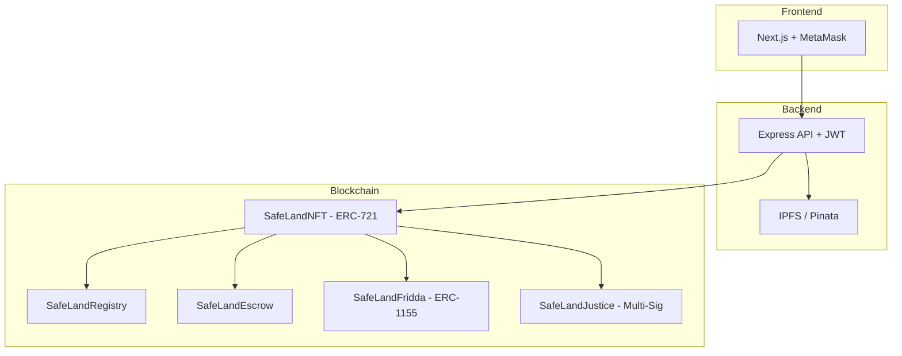

# 🏗️ SafeLand Morocco — Pitch Deck

---

## Slide 1 — Couverture

**SafeLand**
*Cadastre Blockchain Souverain du Royaume du Maroc*

> Sécuriser chaque mètre carré du Maroc sur la blockchain

---

## Slide 2 — Le Problème

### La fraude foncière au Maroc : un fléau systémique

| Indicateur | Chiffre |
|---|---|
| Litiges fonciers en justice | **~68 000 dossiers/an** |
| Coût moyen d'un litige | **120 000 – 500 000 MAD** |
| Délai moyen de résolution | **3 à 7 ans** |
| Fraudes documentaires détectées | **~12 %** des transactions |
| Perte économique estimée | **> 15 milliards MAD/an** |

**Causes racines :**
- Registres papier falsifiables
- Silos d'information entre ANCFCC, notaires, tribunaux
- Absence de traçabilité temps réel
- Successions bloquées faute de consensus entre héritiers

---

## Slide 3 — La Solution

### SafeLand : le cadastre blockchain souverain

```
┌─────────────────────────────────────────────────┐
│               SAFELAND PLATFORM                  │
│                                                  │
│  📜 NFT ERC-721          🔐 Smart Escrow         │
│  Titre foncier digital   Split fiscal auto       │
│  immuable & traçable     DGI 4% + ANCFCC 1%     │
│                                                  │
│  👨‍👩‍👧‍👦 Fridda ERC-1155     ⚖️ Justice Multi-Sig   │
│  Succession 24 parts     Gel, burn/remint        │
│  Gouvernance héritiers   Récupération sociale    │
│                                                  │
│  🛡️ Travel Lock          📁 IPFS                 │
│  Verrou anti-fraude      Documents certifiés     │
│  voyage                  décentralisés           │
└─────────────────────────────────────────────────┘
```

---

## Slide 4 — Avantages Concurrentiels

| Fonctionnalité | SafeLand | Cadastre Actuel |
|---|:---:|:---:|
| Immuabilité des titres | ✅ Blockchain | ❌ Papier |
| Traçabilité complète | ✅ On-chain | ❌ Silos |
| Anti-fraude voyage | ✅ Travel Lock | ❌ Aucun |
| Split fiscal automatique | ✅ Smart contract | ❌ Manuel |
| Succession digitale | ✅ Fridda 24 parts | ❌ Bloquée |
| Intervention justice | ✅ Multi-sig | ❌ Lent |
| Temps de transfert | ✅ < 30 sec | ❌ 2-6 mois |

---

## Slide 5 — Architecture Technique



**Stack :**
- Solidity 0.8.20 / OpenZeppelin UUPS Upgradeable
- Hardhat + Ethers.js v6
- Express.js + JWT + Rate Limiting
- Next.js + TailwindCSS
- IPFS via Pinata (documents certifiés)

---

## Slide 6 — Modèle Économique

### Sources de revenus

| Source | Mécanisme | Projection An 1 |
|---|---|---|
| Frais de tokenisation | 500 MAD / titre | 50M MAD |
| Commission transactions | 0.5% du prix | 25M MAD |
| Abonnement institutionnel | SaaS notaires/agents | 12M MAD |
| API B2B | Banques, assurances | 8M MAD |
| Licence régionale | Export Afrique | 15M MAD |
| **Total estimé** | | **110M MAD** |

### Split fiscal intégré (par transaction)
- **4% → DGI** (Direction Générale des Impôts)
- **1% → ANCFCC** (Conservation Foncière)
- **95% → Vendeur**

---

## Slide 7 — Marché Cible

### TAM / SAM / SOM

| Segment | Taille |
|---|---|
| **TAM** — Marché foncier Maroc | 800 Mds MAD |
| **SAM** — Transactions annuelles | 120 Mds MAD |
| **SOM** — Pénétration An 3 (5%) | 6 Mds MAD |

### Cibles prioritaires
1. **ANCFCC** — Partenaire stratégique (75 conservations)
2. **Notaires** — 2 000+ études au Maroc
3. **Agents immobiliers** — Réseau national
4. **Tribunaux** — Module justice intégré
5. **Banques** — Vérification hypothécaire temps réel

---

## Slide 8 — Conformité Réglementaire

SafeLand est conçu pour être **100% conforme** au cadre légal marocain :

| Loi / Régulation | Application SafeLand |
|---|---|
| **Dahir de 1913** (immatriculation foncière) | NFT comme extension numérique du titre |
| **Loi 14-07** (ANCFCC) | Intégration directe registre |
| **Loi 43-20** (services de confiance) | Signature électronique qualifiée |
| **Loi 09-08** (CNDP) | Protection données personnelles |
| **Code de la famille** (Moudawana) | Fridda — calcul successoral 24 parts |
| **Bank Al-Maghrib** | Escrow conforme réglementation financière |

---

## Slide 9 — Équipe & Gouvernance

### Structure de gouvernance

- **Comité Technique** — Architecture, smart contracts, sécurité
- **Comité Juridique** — Conformité, liaison ANCFCC/DGI
- **Comité Stratégique** — Vision, partenariats, expansion
- **Comité Éthique** — Protection citoyens, transparence

### Partenaires institutionnels visés
- ANCFCC (Conservation Foncière)
- ADD (Agence de Développement du Digital)
- Ordre des Notaires du Maroc
- Ministère de la Justice
- CNDP (Commission Nationale de Protection des Données)

---

## Slide 10 — Roadmap

| Phase | Période | Livrables |
|---|---|---|
| **Phase 0 — Fondation** | T1 2025 | Smart contracts, tests, audits internes |
| **Phase 1 — MVP** | T2 2025 | Plateforme fonctionnelle, pilote Casablanca |
| **Phase 2 — Pilote** | T3-T4 2025 | 3 conservations, 1000 titres tokenisés |
| **Phase 3 — Régional** | T1-T2 2026 | 12 conservations, module succession |
| **Phase 4 — National** | T3-T4 2026 | 75 conservations, 100K+ titres |
| **Phase 5 — Expansion** | 2027+ | Export Afrique francophone (Sénégal, Côte d'Ivoire, Tunisie) |

---

## Slide 11 — Levée de Fonds

### Besoin : **30 millions MAD** (Série Seed)

| Allocation | % | Montant |
|---|---|---|
| Développement technique | 40% | 12M MAD |
| Conformité & juridique | 15% | 4.5M MAD |
| Marketing & partenariats | 15% | 4.5M MAD |
| Infrastructure & sécurité | 15% | 4.5M MAD |
| Opérations & recrutement | 10% | 3M MAD |
| Réserve | 5% | 1.5M MAD |

### Métriques clés
- **Break-even** : Mois 18
- **ROI investisseur** : x5 à 5 ans
- **Utilisateurs cible An 1** : 10 000 propriétaires
- **Titres tokenisés An 1** : 100 000

---

## Slide 12 — Vision

> *« D'ici 2030, chaque titre foncier au Maroc sera un NFT souverain,
> infalsifiable, traçable et accessible en un clic. »*

**SafeLand — الأرض الآمنة**

🇲🇦 Construire la confiance foncière, un bloc à la fois.

---

*Contact : [info@safeland.ma](mailto:info@safeland.ma)*
*Site : [www.safeland.ma](https://www.safeland.ma)*
