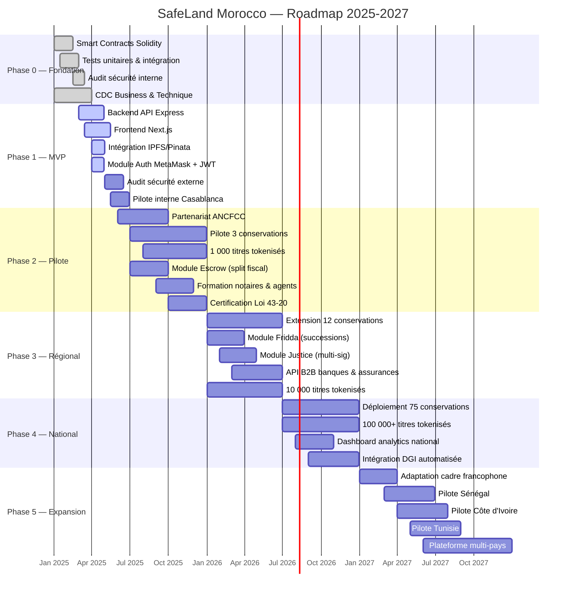
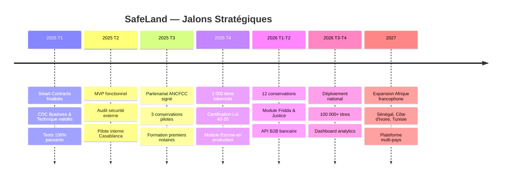

# 🗺️ SafeLand Morocco — Roadmap Visuelle

## Diagramme Gantt

## Jalons Clés (Milestones)

## KPIs par Phase

| Phase | KPI Principal | Objectif |
|---|---|---|
| **Phase 0** | Couverture tests | > 90% |
| **Phase 1** | MVP livré et audité | 100% features |
| **Phase 2** | Titres tokenisés | 1 000 |
| **Phase 3** | Conservations connectées | 12 |
| **Phase 4** | Titres tokenisés | 100 000+ |
| **Phase 5** | Pays couverts | 4 (Maroc + 3) |

## Flux de Progression

```mermaid
flowchart LR
    A[Phase 0<br/>Fondation] -->|Smart Contracts<br/>Tests & Audit| B[Phase 1<br/>MVP]
    B -->|Pilote interne<br/>Casablanca| C[Phase 2<br/>Pilote]
    C -->|3 conservations<br/>1K titres| D[Phase 3<br/>Régional]
    D -->|12 conservations<br/>Fridda + Justice| E[Phase 4<br/>National]
    E -->|75 conservations<br/>100K+ titres| F[Phase 5<br/>Expansion]
    F -->|Afrique<br/>francophone| G((🌍 Vision<br/>2030))

    style A fill:#e8f5e9
    style B fill:#c8e6c9
    style C fill:#a5d6a7
    style D fill:#81c784
    style E fill:#66bb6a
    style F fill:#4caf50
    style G fill:#2e7d32,color:#fff
```

